# Mapping of OWL 2 Web Ontology Language to Labeled Property Graphs

Working Draft, Updated: 17 June 2020


**Feedback**:

​	[Protégé team](mailto:protege-basf@lists.stanford.edu)

**Document Source Control**:

​	[GitHub](https://github.com/protegeproject/owl2lpg/)

**Issue Tracking**:

​	[GitHub](https://github.com/protegeproject/owl2lpg/issues/)

**Editors**:

​	[Rafael Gonçalves](https://rsgoncalves.com) (Stanford University)

​	[Josef Hardi](https://profiles.stanford.edu/josef-hardi) (Stanford University)

​	[Matthew Horridge](https://web.stanford.edu/~horridge) (Stanford University)

**Contributors**:

​	[Alexander García Castro](mailto:alexander.garcia-castro@basf.com) (BASF)

​	[José Antonio Bernabé Díaz](mailto:jose-antonio.bernabe-diaz@basf.com) (BASF)

​	[Juergen Mueller](mailto:juergen.a.mueller@basf.com) (BASF)

---


## Abstract

This document specificies a mapping of the OWL 2 Web Ontology Language to Labeled Property Graphs (LPGs), and vice versa.


## Status of this document

This is a public copy of the editors’ draft. It is provided for discussion only and may change at any moment. Do not cite this document other than as work in progress.


---

**Table of Content**

* [1 Introduction](#1-introduction)
   * [1.1 Main Requirements](#11-main-requirements)
      * [1.1.1 Tooling Requirements](#111-tooling-requirements)
      * [1.1.2 Other Requirements](#112-other-requirements)
   * [1.2 Design Choices](#12-design-choices)
   * [1.3 Document Conventions](#13-document-conventions)
   * [1.4 Similar Works](#14-similar-works)
      * [1.4.1 SciGraph](#141-scigraph)
      * [1.4.2 VirtualFlyBrain](#142-virtualflybrain)
      * [1.4.3 OWL2Neo4J](#143-owl2neo4j)
* [2 Entities, Literals, and Annonymous Individuals](#2-entities-literals-and-annonymous-individuals)
   * [2.1 Entities](#21-entities)
      * [2.1.1 Class](#211-class)
      * [2.1.2 Object Property](#212-object-property)
      * [2.1.3 Data Property](#213-data-property)
      * [2.1.4 Annotation Property](#214-annotation-property)
      * [2.1.5 Named Individual](#215-named-individual)
      * [2.1.6 Datatype](#216-datatype)
      * [2.1.7 Entity Declaration Axiom](#217-entity-declaration-axiom)
   * [2.2 Literals](#22-literals)
   * [2.3 Annonymous Individuals](#23-annonymous-individuals)
* [3 Class Expressions](#3-class-expressions)
   * [3.1 Propositional Connectives and Enumeration of Individuals](#31-propositional-connectives-and-enumeration-of-individuals)
      * [3.1.1 Intersection of Class Expressions](#311-intersection-of-class-expressions)
      * [3.1.2 Union of Class Expressions](#312-union-of-class-expressions)
      * [3.1.3 Complement of Class Expressions](#313-complement-of-class-expressions)
      * [3.1.4 Enumeration of Individuals](#314-enumeration-of-individuals)
   * [3.2 Object Property Restrictions](#32-object-property-restrictions)
      * [3.2.1 Existential Quantification](#321-existential-quantification)
      * [3.2.2 Universal Quantification](#322-universal-quantification)
      * [3.2.3 Individual Value Restriction](#323-individual-value-restriction)
      * [3.2.4 Self-Restriction](#324-self-restriction)
   * [3.3 Object Property Cardinality Restrictions](#33-object-property-cardinality-restrictions)
      * [3.3.1 Minimum Cardinality](#331-minimum-cardinality)
      * [3.3.2 Maximum Cardinality](#332-maximum-cardinality)
      * [3.3.3 Exact Cardinality](#333-exact-cardinality)
   * [3.4 Data Property Restrictions](#34-data-property-restrictions)
      * [3.4.1 Existential Quantification](#341-existential-quantification)
      * [3.4.2 Universal Quantification](#342-universal-quantification)
      * [3.4.3 Literal Value Restriction](#343-literal-value-restriction)
   * [3.5 Data Property Cardinality Restrictions](#35-data-property-cardinality-restrictions)
      * [3.5.1 Minimum Cardinality](#351-minimum-cardinality)
      * [3.5.2 Maximum Cardinality](#352-maximum-cardinality)
      * [3.5.3 Exact Cardinality](#353-exact-cardinality)
* [4 Property Expressions](#4-property-expressions)
   * [4.1 Inverse Object Properties](#41-inverse-object-properties)
* [5 Data Ranges](#5-data-ranges)
   * [5.1 Intersection of Data Ranges](#51-intersection-of-data-ranges)
   * [5.2 Union of Data Ranges](#52-union-of-data-ranges)
   * [5.3 Complement of Data Ranges](#53-complement-of-data-ranges)
   * [5.4 Enumeration of Literals](#54-enumeration-of-literals)
   * [5.5 Datatype Restrictions](#55-datatype-restrictions)
* [6 Axioms](#6-axioms)
   * [6.1 Class Expression Axioms](#61-class-expression-axioms)
      * [6.1.1 Subclass](#611-subclass)
      * [6.1.2 Equivalent Classes](#612-equivalent-classes)
      * [6.1.3 Disjoint Classes](#613-disjoint-classes)
   * [6.2 Object Property Axioms](#62-object-property-axioms)
      * [6.2.1 Object Subproperties](#621-object-subproperties)
      * [6.2.2 Equivalent Object Properties](#622-equivalent-object-properties)
      * [6.2.3 Disjoint Object Properties](#623-disjoint-object-properties)
      * [6.2.4 Inverse Object Properties](#624-inverse-object-properties)
      * [6.2.5 Object Property Domain](#625-object-property-domain)
      * [6.2.6 Object Property Range](#626-object-property-range)
      * [6.2.7 Functional Object Property](#627-functional-object-property)
      * [6.2.8 Inverse Functional Object Property](#628-inverse-functional-object-property)
      * [6.2.9 Reflexive Object Property](#629-reflexive-object-property)
      * [6.2.10 Irreflexive Object Property](#6210-irreflexive-object-property)
      * [6.2.11 Symmetric Object Property](#6211-symmetric-object-property)
      * [6.2.12 Asymmetric Object Property](#6212-asymmetric-object-property)
      * [6.2.13 Transitive Object Property](#6213-transitive-object-property)
   * [6.3 Data Property Axioms](#63-data-property-axioms)
      * [6.3.1 Data Subproperties](#631-data-subproperties)
      * [6.3.2 Equivalent Data Properties](#632-equivalent-data-properties)
      * [6.3.3 Disjoint Data Properties](#633-disjoint-data-properties)
      * [6.3.4 Data Property Domain](#634-data-property-domain)
      * [6.3.5 Data Property Range](#635-data-property-range)
      * [6.3.6 Functional Data Properties](#636-functional-data-properties)
   * [6.4 Assertions](#64-assertions)
      * [6.4.1 Class Assertions](#641-class-assertions)
      * [6.4.2 Positive Object Property Assertions](#642-positive-object-property-assertions)
      * [6.4.3 Negative Object Property Assertions](#643-negative-object-property-assertions)
      * [6.4.4 Positive Data Property Assertions](#644-positive-data-property-assertions)
      * [6.4.5 Negative Data Property Assertions](#645-negative-data-property-assertions)
      * [6.4.6 Individual Equality](#646-individual-equality)
      * [6.4.7 Individual Inequality](#647-individual-inequality)
* [7 Annotations](#7-annotations)
   * [7.1 Annotation of Ontologies, Axioms, and other Annotations](#71-annotation-of-ontologies-axioms-and-other-annotations)
   * [7.2 Annotation Axioms](#72-annotation-axioms)
      * [7.2.1 Annotation Assertions](#721-annotation-assertions)
      * [7.2.2 Annotation Subproperties](#722-annotation-subproperties)
      * [7.2.3 Annotation Property Domain](#723-annotation-property-domain)
      * [7.2.4 Annotation Property Range](#724-annotation-property-range)
* [8 Change History](#8-change-history)   
   * [8.1 Ontology Changes](#81-ontology-changes)
      * [8.1.1 Axiom Changes](#811-axiom-changes)
      * [8.1.2 Annotation Changes](#812-annotation-changes)
   * [8.2 Project History](#82-project-history)
      * [8.2.1 High-Level Descriptions](#821-high-level-descriptions)

---


## 1 Introduction

This document describes a mapping of OWL 2 ontologies to a Labeled Property Graph (LPG) representation, and vice-versa. The full specification of the mapping is given in the [MAPPING](https://protegeproject.github.io/owl2lpg/mapping) document (e.g., for implementation). 


### 1.1 Main Requirements

In this section we lay out important requirements that drive the design of the OWL to LPG mapping.

#### 1.1.1 Tooling Requirements

Here we enumerate illustrative examples of the kinds of queries that should be both easily expressible (in [Cypher](https://neo4j.com/developer/cypher-query-language)) and well performant for large knowledge bases. We use the [WebProtégé cloud-based ontology editor](https://webprotege.stanford.edu) as the baseline for performance. The goal is to achieve a query performance that is superior to the performance of executing the same queries in WebProtégé 4.0 (non-LPG).

Example queries:
1. Get the axioms in a frame for class `A`.
2. Get the axioms that mention class `A`.
3. Get the revisions for an ontology `O`.
4. Get the revisions that alter the frame for class `A`.
5. Get the authors of changes to class `A`.
6. Get the last changes for class `A`.
7. Get the axioms in the latest revision of ontology `O`.

#### 1.1.2 Other Requirements

TBA


### 1.2 Design Choices

Our overarching design principle is to prioritize representational **consistency over convenience** (of query writing, of query response time, etc.). Below we describe some key design choices:

- **The types of OWL objects are specified by the labels on nodes in a LPG**. The types of each OWL object are specified as labels on the nodes that represent those objects, using *reserved keywords* drawn from the OWL 2 specification (see [1.3 Document Conventions](#13-document-conventions)). For example, a node labeled `:Class:Entity:ClassExpression` represents an OWL class entity, which is an atomic class expression. Giving the most specific type along with the more generic type(s) allows us to retrieve, for example, all OWL entities in a LPG, or all OWL class expressions.

- **OWL axioms are mapped to a LPG using a unique node to represent the axiom type with outgoing edges to its elements**. Each OWL axiom is assigned a unique node in a LPG, with at least one outgoing edge to a node representing an entity expression. For example, an OWL SubClassOf axiom is mapped to a LPG using one `:SubClassOf:Axiom` (multi-label) node and two outgoing edges labeled `subClassExpression` and `superClassExpression` that link to `:ClassExpression` nodes. Representing each OWL axiom with a unique node in a LPG allows the following:

  1. Encoding OWL axiom annotations in a manner that is consistent with our overall representation of OWL annotations (as `:Literal` or `:IRI` nodes linked to the node that represents the annotation subject).
  2. Attaching versioning information about the axiom (see [Change History](#change-history) for details).

  Similarly, other OWL constructs such as class expressions and data ranges are mapped to a LPG using a node to represent the construct type (e.g., SomeValuesFrom class expression) with outgoing edges to its elements.

- **Each named OWL entity is mapped to a unique `:Entity` node in a LPG.** Every named OWL 2 entity (class, object property, data property, annotation property, individual or datatype) maps to a unique node in a LPG, which is reused whenever the entity is mentioned in axioms. For example, consider the axioms: 

  ```
  AX1: A SubClassOf p some B
  AX2: A SubClassOf p some C
  AX3: B SubClassOf D
  ```

  The node for class `A` will be reused (and shared) by `AX1` and `AX2`, and the node for class `B` will be reused (and shared) by `AX1` and `AX3`.


### 1.3 Document Conventions

OWL axioms are written out using [OWL Functional-Style syntax](https://www.w3.org/TR/owl2-syntax) , similar to the OWL 2 specification.

A Labeled Property Graph diagram consists of nodes and edges. A node is depicted as a rectangle with rounded corners. An edge is depicted as either a uni-directional arrow or a bi-directional arrow.

**Non-Terminal Node**

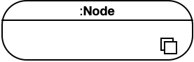

**Terminal Node**

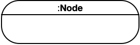


| Non-Terminal Node                                            | Terminal Node                                                |
| ------------------------------------------------------------ | ------------------------------------------------------------ |
| 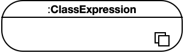 | 1) **Named Class**. See [Section 2.1.1 Class](#211-class).<br />2) **Complex Class Expressions**. See [Section 3 Class Expressions](#3-class-expressions). |
| 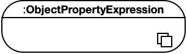 | 1) **Named Object Property**. See [Section 2.1.2 Object Property](#212-object-property)<br />2) **Complex Object Property Expressions**. See [Section 4 Property Expressions](#4-property-expressions). |
| 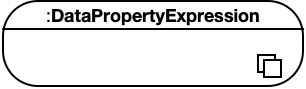 | **Named Data Property**. See [Section 2.1.3 Data Property](#213-data-property). |
| 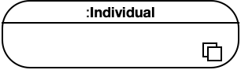 | 1) **Named Individual**. See [Section 2.1.5 Named Individual](#215-named-individual).<br />2) **Annonymous Individual**. See [Section 2.3 Annonymous Individuals](#23-annonymous-individuals). |
| 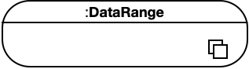 | **Data Range Expressions**. See [Section 5 Data Ranges](#5-data-ranges). |


### 1.4 Similar Works

In this section we compare and contrast the mapping described in this document with existing approaches to map OWL ontologies to LPGs.

#### 1.4.1 SciGraph

The [SciGraph Neo4j Mapping](https://github.com/SciGraph/SciGraph/wiki/Neo4jMapping) aims to support representing multiple ontologies as a Labeled Property Graph. SciGraph reads ontologies with the OWL API and converts them to a LPG. *SciGraph does not aim to support creating ontologies based on the LPG.* Below we outline and briefly describe key differences between ours and the SciGraph mapping.

- **OWL axiom types are represented as edges in a LPG.** In the SciGraph mapping, axiom types such as `rdfs:subClassOf` are encoded as edges between nodes that represent the left and the right hand side of the axiom. Axiom annotations are represented as key-value string properties on the edge that denotes the axiom type. In our mapping, axiom types are represented as nodes, and therefore axiom annotations are represented uniformly like other annotation assertions.
- **Annotation assertions are represented as key-value string properties in a LPG.** For example, `i:Individual {'rdfs:label' = 'Ruth'}`. As a consequence, annotations on annotations are not straightforwardly representable in SciGraph.
- **Representation of source ontology in SciGraph is done both at the node and edge level of a LPG.** In the SciGraph mapping, nodes have an outgoing edge named `isDefinedBy` to a node of type `Ontology` that denotes the source ontology, and edges have a key-value string property to denote the source ontology IRI. In our mapping, the source ontology of axioms will be encoded as a node connected to the nodes denoting the axiom types (e.g., `rdfs:SubClassOf, owl:EquivalentClasses`).
- **SciGraph represents OWL properties as both nodes and edges in a LPG.** It represents OWL property types (functional, symmetric, etc.) as key-value properties on LPG **nodes** that represent the OWL properties (e.g., `hasSibling:ObjectProperty {'symmetric' = true}`). And then SciGraph uses OWL properties as **edges** in axioms such as object property assertions (e.g., `rafael:Individual --hasSibling:ObjectProperty --> ruth:Individual`. In our mapping, we consistently represent OWL properties as nodes. More, we represent OWL property characteristics similarly to the OWL/XML and Functional-style syntaxes of OWL. E.g., `hasSibling:ObjectProperty --> SymmetricObjectProperty:Axiom`.


#### 1.4.2 VirtualFlyBrain

The [VirtualFlyBrain OWL 2 EL to Neo4J Mapping](https://github.com/VirtualFlyBrain/neo4j2owl) allows importing "a well defined subset of OWL 2 EL ontologies into and export them from Neo4J, in such a way that entailments and annotations are preserved (not however the syntactic structure) in the ontology after the round-trip." The VirtualFlyBrain (VFB) mapping is explicit about its design goal of facilitating intuitive writing of Cypher queries. In that sense, VFB does not create "anonymous" nodes to represent axiom types or class expression types, and instead encodes these details on edges (relying on both edge names and key-value string properties on edges).

- **Object property names and axiom types are encoded as edge names.** For example, the axioms: `A SubClassOf B. A SubClassOf r some C` would be encoded in LPG as: `A--SubClassOf-->B. A--r-->B`. The restriction qualifiers (or quantifiers) are encoded as key-value properties on edges.
- **The VFB mapping represents OWL properties as both nodes and edges.** Similar to SciGraph, OWL object properties are represented as edges, and then they are also represented as nodes to be able to express axioms such as annotations on those properties.
- **Data and Annotation property assertions are represented as key-value string properties.** Also similar to SciGraph, both data and annotation property assertions are represented as key-value string properties on nodes. As a consequence, annotations on annotations are not straightforwardly representable in VFB.


#### 1.4.3 OWL2Neo4J

The [OWL2Neo4J tool](https://github.com/flekschas/owl2neo4j) allows converting OWL ontologies to Labeled Property Graphs. The tool documentation states that it "only converts the class hierarchy; instances are ignored for now." Overall it is unclear what subset of the OWL language is supported, and whether round-tripping is feasible. This project looks defunct—it was last updated on September 2018.


## 2 Entities, Literals, and Annonymous Individuals

### 2.1 Entities

#### 2.1.1 Class

*Classes* can be understood as sets of individuals.

<u>LPG Diagram</u>:

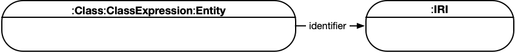


#### 2.1.2 Object Property

*Object properties* connect pairs of individuals.

<u>LPG Diagram</u>:

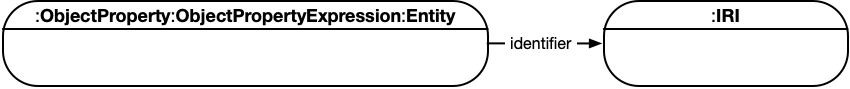


#### 2.1.3 Data Property

*Data properties* connect individuals with literals. In some knowledge representation systems, functional data properties are called *attributes*.

<u>LPG Diagram</u>:


#### 2.1.4 Annotation Property

*Annotation properties* can be used to provide an annotation for an ontology, axiom, or an IRI. The structure of annotations is further described in [Annotations](#7-annotations).

<u>LPG Diagram</u>:

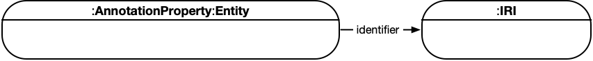


#### 2.1.5 Named Individual

*Individuals* represent actual objects from the domain. There are two types of individuals in the syntax of OWL 2. *Named individuals* are given an explicit name that can be used in any ontology to refer to the same object. *Named individuals* are identified using an IRI.

<u>LPG Diagram</u>:

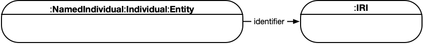


#### 2.1.6 Datatype

*Datatypes* are entities that refer to sets of data values. Thus, datatypes are analogous to classes, the main difference being that the former contain data values such as strings and numbers, rather than individuals. Datatypes are a kind of data range, which allows them to be used in restrictions. As explained in [Data Ranges](#5-data-ranges), each data range is associated with an arity; for datatypes, the arity is always one.

The built-in datatype *rdfs:Literal* denotes any set of data values that contains the union of the value spaces of all datatypes.

<u>LPG Diagram</u>:

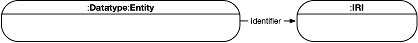


#### 2.1.7 Entity Declaration Axiom

In OWL 2, declarations are a type of axiom; thus, to declare an entity in an ontology, one can simply include the appropriate axiom in the ontology. These axioms are nonlogical in the sense that they do not affect the consequences of an OWL 2 ontology.

<u>LPG Diagram</u>:

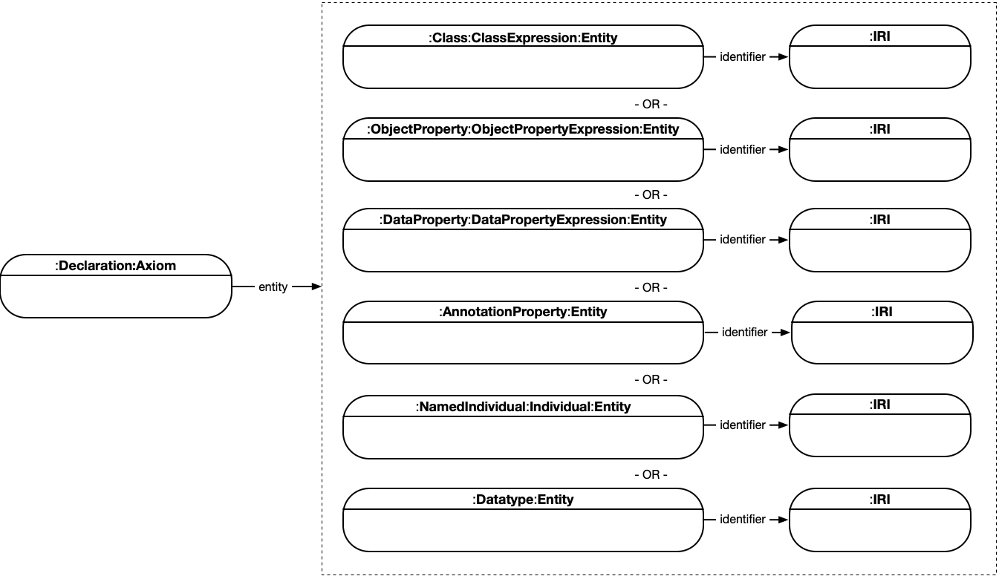


### 2.2 Literals

*Literals* represent data values such as particular strings or integers. Each literal consists of a lexical form, which is a string, a datatype and an optional language tag. A literal consisting of a lexical form "abc" and a datatype identified by the IRI *datatypeIRI* is written as "abc"^^*datatypeIRI*. Furthermore, literals whose datatype is *rdf:PlainLiteral* can be abbreviated as plain RDF literals.

 <u>LPG Diagram</u>:


### 2.3 Annonymous Individuals

If an individual is not expected to be used outside a particular ontology, one can use an *anonymous individual*, which is identified by a local node ID rather than a global IRI.

<u>LPG Diagram</u>:

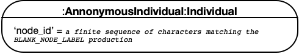


## 3 Class Expressions

### 3.1 Propositional Connectives and Enumeration of Individuals

#### 3.1.1 Intersection of Class Expressions

An *intersection* class expression `ObjectIntersectionOf( CE1 ... CEn )` contains all individuals that are instances of all class expressions `CEi` for 1 ≤ i ≤ n.

<u>OWL 2 Notation</u>:

​	**ObjectIntersectionOf** := 'ObjectIntersectionOf' '(' **ClassExpression** **ClassExpression** ')'

<u>LPG Diagram</u>:

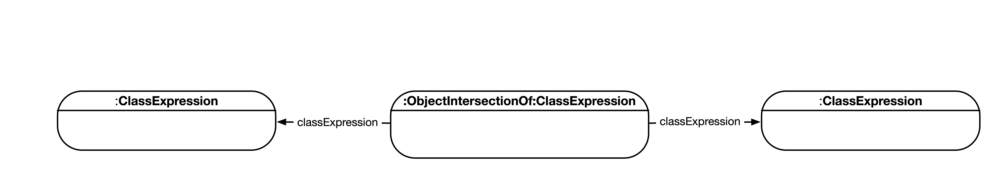


#### 3.1.2 Union of Class Expressions

A *union* class expression `ObjectUnionOf( CE1 ... CEn )` contains all individuals that are instances of at least one class expression `CEi` for 1 ≤ i ≤ n.

<u>OWL 2 Notation</u>:

​	**ObjectUnionOf** := 'ObjectUnionOf' '(' **ClassExpression** **ClassExpression** ')'

<u>LPG Diagram</u>:

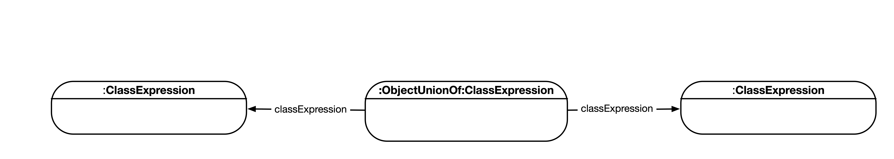


#### 3.1.3 Complement of Class Expressions

A complement class expression `ObjectComplementOf( CE )` contains all individuals that are not instances of the class expression `CE`.

<u>OWL 2 Notation</u>:

​	**ObjectComplementOf** := 'ObjectComplementOf' '(' **ClassExpression** ')'

<u>LPG Diagram</u>:

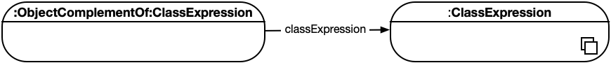


#### 3.1.4 Enumeration of Individuals

An enumeration of individuals `ObjectOneOf( a1 ... an )` contains exactly the individuals `ai` with 1 ≤ i ≤ n.

<u>OWL 2 Notation</u>:

​	**ObjectOneOf** := 'ObjectOneOf' '(' **Individual** { **Individual** }')'

<u>LPG Diagram</u>:

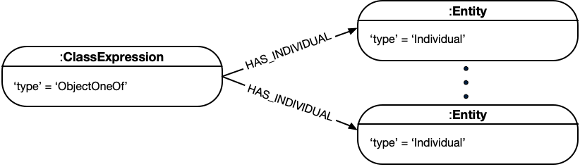


### 3.2 Object Property Restrictions

#### 3.2.1 Existential Quantification

An *existential* class expression `ObjectSomeValuesFrom( OPE CE )` consists of an object property expression `OPE` and a class expression `CE`, and it contains all those individuals that are connected by `OPE` to an individual that is an instance of `CE`. 

<u>OWL 2 Notation</u>:

​	**ObjectSomeValuesFrom** := 'ObjectSomeValuesFrom' '(' **ObjectPropertyExpression** **ClassExpression** ')'

<u>LPG Diagram</u>:

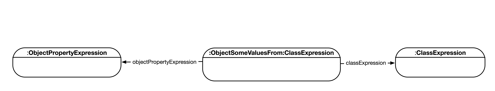


#### 3.2.2 Universal Quantification

A *universal* class expression `ObjectAllValuesFrom( OPE CE )` consists of an object property expression `OPE` and a class expression `CE`, and it contains all those individuals that are connected by `OPE` only to individuals that are instances of `CE`. 

<u>OWL 2 Notation</u>:

​	**ObjectAllValuesFrom** := 'ObjectAllValuesFrom' '(' **ObjectPropertyExpression** **ClassExpression** ')'

<u>LPG Diagram</u>:

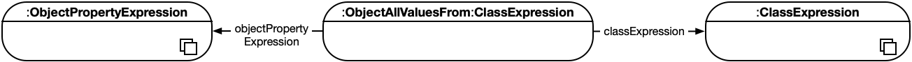


#### 3.2.3 Individual Value Restriction

A has-value class expression `ObjectHasValue( OPE a )` consists of an object property expression `OPE` and an individual a, and it contains all those individuals that are connected by `OPE` to `a`. 

<u>OWL 2 Notation</u>:

​	**ObjectHasValue** := 'ObjectHasValue' '(' **ObjectPropertyExpression** **Individual** ')'

<u>LPG Diagram</u>:

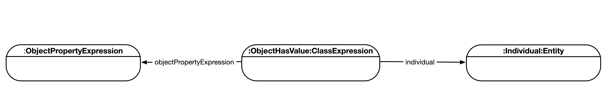


#### 3.2.4 Self-Restriction

A self-restriction `ObjectHasSelf( OPE )` consists of an object property expression `OPE`, and it contains all those individuals that are connected by `OPE` to themselves.

<u>OWL 2 Notation</u>:

​	**ObjectHasSelf** := 'ObjectHasSelf' '(' **ObjectPropertyExpression** ')'

<u>LPG Diagram</u>:

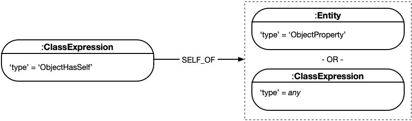


### 3.3 Object Property Cardinality Restrictions

#### 3.3.1 Minimum Cardinality

A *minimum cardinality* expression `ObjectMinCardinality( n OPE CE )` consists of a nonnegative integer `n`, an object property expression `OPE`, and a class expression `CE`, and it contains all those individuals that are connected by `OPE` to at least `n` different individuals that are instances of `CE`. If `CE` is missing, it is taken to be *owl:Thing*.

<u>OWL 2 Notation</u>:

​	**ObjectMinCardinality** := 'ObjectMinCardinality' '(' **nonNegativeInteger** **ObjectPropertyExpression** [ **ClassExpression** ] ')'

<u>LPG Diagram</u>:


#### 3.3.2 Maximum Cardinality

A *maximum cardinality* expression `ObjectMaxCardinality( n OPE CE )` consists of a nonnegative integer `n`, an object property expression `OPE`, and a class expression `CE`, and it contains all those individuals that are connected by `OPE` to at most `n` different individuals that are instances of `CE`. If `CE` is missing, it is taken to be *owl:Thing*.

<u>OWL 2 Notation</u>:

​	**ObjectMaxCardinality** := 'ObjectMaxCardinality' '(' **nonNegativeInteger** **ObjectPropertyExpression** [ **ClassExpression** ] ')'

<u>LPG Diagram</u>:

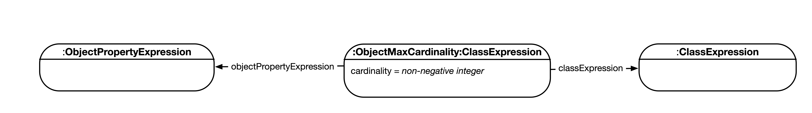


#### 3.3.3 Exact Cardinality

An *exact cardinality* expression `ObjectExactCardinality( n OPE CE )` consists of a nonnegative integer `n`, an object property expression `OPE`, and a class expression `CE`, and it contains all those individuals that are connected by `OPE` to exactly `n` different individuals that are instances of `CE`. If `CE` is missing, it is taken to be *owl:Thing*.

<u>OWL 2 Notation</u>:

​	**ObjectExactCardinality** := 'ObjectExactCardinality' '(' **nonNegativeInteger** **ObjectPropertyExpression** [ **ClassExpression** ] ')'

<u>LPG Diagram</u>:

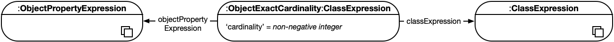


### 3.4 Data Property Restrictions

#### 3.4.1 Existential Quantification

An *existential* class expression `DataSomeValuesFrom( DPE1 ... DPEn DR )` consists of `n` data property expressions `DPEi`, 1 ≤ i ≤ n, and a data range `DR` whose arity *must* be `n`. Such a class expression contains all those individuals that are connected by `DPi` to literals `lti`, 1 ≤ i ≤ n, such that the tuple `( lt1 , ..., ltn )` is in `DR`.

<u>OWL 2 Notation</u>:

​	**DataSomeValuesFrom** := 'DataSomeValuesFrom' '(' **DataPropertyExpression** { **DataPropertyExpression** } **DataRange** ')'

<u>LPG Diagram</u>:

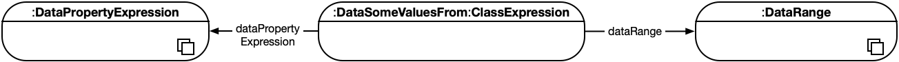


#### 3.4.2 Universal Quantification

A *universal* class expression `DataAllValuesFrom( DPE1 ... DPEn DR )` consists of `n` data property expressions `DPEi`, 1 ≤ i ≤ n, and a data range `DR` whose arity *must* be `n`. Such a class expression contains all those individuals that are connected by `DPi` only to literals `lti`, 1 ≤ i ≤ n, such that each tuple `( lt1 , ..., ltn )` is in `DR`.

<u>OWL 2 Notation</u>:

​	**DataAllValuesFrom** := 'DataAllValuesFrom' '(' **DataPropertyExpression** { **DataPropertyExpression** } **DataRange** ')'

<u>LPG Diagram</u>:

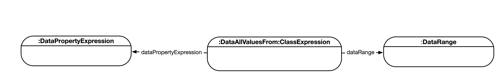


#### 3.4.3 Literal Value Restriction

A has-value class expression `DataHasValue( DP lt )` consists of a data property `DP` and a literal `lt`, and it contains all those individuals that are connected by `DP` to `lt`.

<u>OWL 2 Notation</u>:

​	**DataHasValue** := 'DataHasValue' '(' **DataProperty** **Literal** ')'

<u>LPG Diagram</u>:

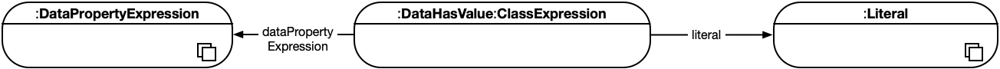


### 3.5 Data Property Cardinality Restrictions

#### 3.5.1 Minimum Cardinality 

A *minimum cardinality* expression `DataMinCardinality( n DPE DR )` consists of a nonnegative integer `n`, a data property expression `DPE`, and a unary data range `DR`, and it contains all those individuals that are connected by `DPE` to at least `n` different literals in `DR`. If `DR` is not present, it is taken to be *rdfs:Literal*.

<u>OWL 2 Notation</u>:

​	**DataMinCardinality** := 'DataMinCardinality' '(' **nonNegativeInteger** **DataPropertyExpression** [ **DataRange** ] ')'

<u>LPG Diagram</u>:

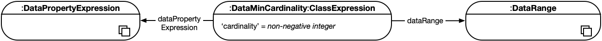


#### 3.5.2 Maximum Cardinality 

A *maximum cardinality* expression `DataMaxCardinality( n DPE DR )` consists of a nonnegative integer `n`, a data property expression `DPE`, and a unary data range `DR`, and it contains all those individuals that are connected by `DPE` to at most `n` different literals in `DR`. If `DR` is not present, it is taken to be *rdfs:Literal*.

<u>OWL 2 Notation</u>:

​	**DataMaxCardinality** := 'DataMaxCardinality' '(' **nonNegativeInteger** **DataPropertyExpression** [ **DataRange** ] ')'

<u>LPG Diagram</u>:

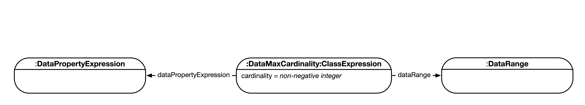


#### 3.5.3 Exact Cardinality 

An *exact cardinality* expression `DataExactCardinality( n DPE DR )` consists of a nonnegative integer `n`, a data property expression `DPE`, and a unary data range `DR`, and it contains all those individuals that are connected by `DPE` to exactly `n` different literals in `DR`. If `DR` is not present, it is taken to be *rdfs:Literal*.

<u>OWL 2 Notation</u>:

​	**DataExactCardinality** := 'DataExactCardinality' '(' **nonNegativeInteger** **DataPropertyExpression** [ **DataRange** ] ')'

<u>LPG Diagram</u>:


## 4 Property Expressions

### 4.1 Inverse Object Properties

An inverse object property expression ObjectInverseOf( P ) connects an individual I1 with I2 if and only if the object property P connects I2 with I1.

<u>OWL 2 Notation</u>:

​	**InverseObjectProperty** := 'ObjectInverseOf' '(' **ObjectProperty** ')'

<u>LPG Diagram</u>:

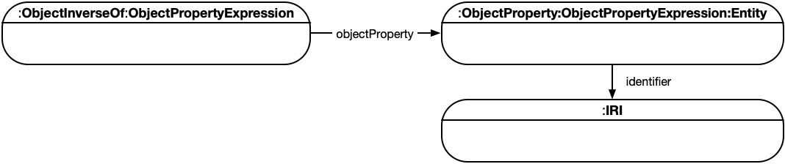


## 5 Data Ranges

### 5.1 Intersection of Data Ranges

An *intersection* data range `DataIntersectionOf( DR1 ... DRn )` contains all tuples of literals that are contained in each data range `DRi` for 1 ≤ i ≤ n. All data ranges `DRi` *must* be of the same arity, and the resulting data range is of that arity as well.

<u>OWL 2 Notation</u>:

  **DataIntersectionOf** := 'DataIntersectionOf' '(' **DataRange** **DataRange** { **DataRange** } ')'

<u>LPG Diagram</u>:

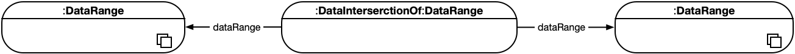

### 5.2 Union of Data Ranges

A *union* data range `DataUnionOf( DR1 ... DRn )` contains all tuples of literals that are contained in the at least one data range `DRi` for 1 ≤ i ≤ n. All data ranges `DRi` *must* be of the same arity, and the resulting data range is of that arity as well.

<u>OWL 2 Notation</u>:

  **DataUnionOf** := 'DataUnionOf' '(' **DataRange** **DataRange** { **DataRange** } ')'

<u>LPG Diagram</u>:

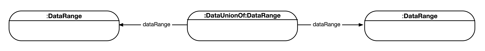

### 5.3 Complement of Data Ranges

A complement data range `DataComplementOf( DR )` contains all tuples of literals that are not contained in the data range `DR`. The resulting data range has the arity equal to the arity of `DR`.

<u>OWL 2 Notation</u>:

  **DataComplementOf** := 'DataComplementOf' '(' **DataRange** ')'

<u>LPG Diagram</u>:

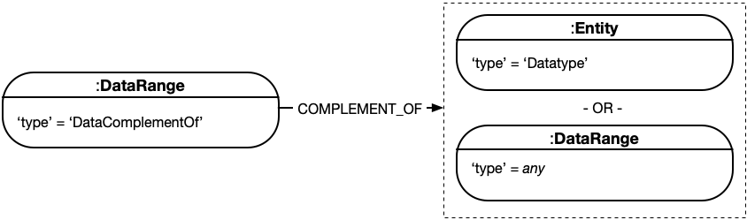


### 5.4 Enumeration of Literals

An enumeration of literals `DataOneOf( lt1 ... ltn )` contains exactly the explicitly specified literals `lti` with 1 ≤ i ≤ n. The resulting data range has arity one.

<u>OWL 2 Notation</u>:

  **DataOneOf** := 'DataOneOf' '(' **Literal** { **Literal** } ')'

<u>LPG Diagram</u>:

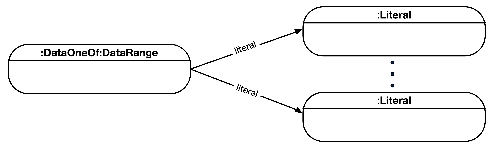


### 5.5 Datatype Restrictions

A datatype restriction `DatatypeRestriction( DT F1 lt1 ... Fn ltn )` consists of a unary datatype `DT` and `n` pairs `( Fi , lti )`. The resulting data range is unary and is obtained by restricting the value space of `DT` according to the semantics of all `( Fi , vi )` (multiple pairs are interpreted conjunctively), where `vi` are the data values of the literals `lti`.

In an OWL 2 DL ontology, each pair `( Fi , vi )` *must* be contained in the facet space of `DT` (see [Datatype Maps](https://www.w3.org/TR/owl2-syntax/#Datatype_Maps) from the OWL 2 specification document).

<u>OWL 2 Notation</u>:

  **DatatypeRestriction** := 'DatatypeRestriction' '(' **Datatype** **constrainingFacet** **restrictionValue** { **constrainingFacet** **restrictionValue** } ')'

  **constrainingFacet** := **IRI**

  **restrictionValue** := **Literal**

<u>LPG Diagram</u>:

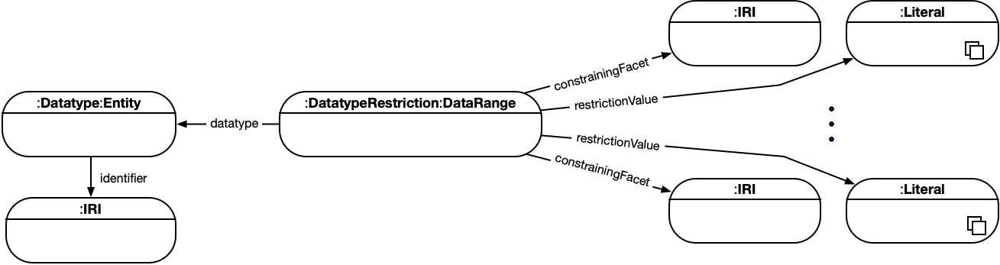


## 6 Axioms

### 6.1 Class Expression Axioms

#### 6.1.1 Subclass

A subclass axiom `SubClassOf( CE1 CE2 )` states that the class expression `CE1` is a subclass of the class expression `CE2`. Roughly speaking, this states that `CE1` is more specific than `CE2`.

<u>OWL 2 Notation</u>:

​	**SubClassOf** := 'SubClassOf' '(' { **Annotation** } **subClassExpression** **superClassExpression** ')'

​	**subClassExpression** := **ClassExpression**

​	**superClassExpression** := **ClassExpression**

<u>LPG Diagram</u>:

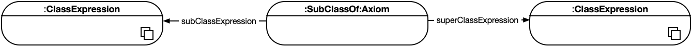


#### 6.1.2 Equivalent Classes

An equivalent classes axiom `EquivalentClasses( CE1 ... CEn )` states that all of the class expressions `CEi`, 1 ≤ i ≤ n, are semantically equivalent to each other. This axiom allows one to use each `CEi` as a synonym for each `CEj` — that is, in any expression in the ontology containing such an axiom, `CEi` can be replaced with `CEj` without affecting the meaning of the ontology.

<u>OWL 2 Notation</u>:

​	**EquivalentClasses** := 'EquivalentClasses' '(' { **Annotation** } **ClassExpression** **ClassExpression** { **ClassExpression** } ')'

<u>LPG Diagram</u>:

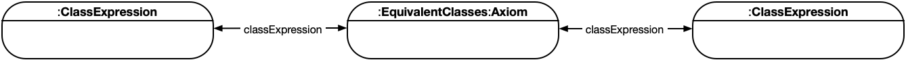


#### 6.1.3 Disjoint Classes

A disjoint classes axiom `DisjointClasses( CE1 ... CEn )` states that all of the class expressions `CEi`, 1 ≤ i ≤ n, are pairwise disjoint; that is, no individual can be at the same time an instance of both `CEi` and `CEj` for i ≠ j. 

<u>OWL 2 Notation</u>:

​	**DisjointClasses** := 'DisjointClasses' '(' { **Annotation** } **ClassExpression** **ClassExpression** { **ClassExpression** } ')'

<u>LPG Diagram</u>:


### 6.2 Object Property Axioms

#### 6.2.1 Object Subproperties

An object subproperty axiom `SubObjectPropertyOf( OPE1 OPE2 )`. This axiom states that the object property expression `OPE1` is a subproperty of the object property expression `OPE2` — that is, if an individual `x` is connected by `OPE1` to an individual `y`, then`x` is also connected by `OPE2` to `y`.

<u>OWL 2 Notation</u>:

​	**SubObjectPropertyOf** := 'SubObjectPropertyOf' '(' { **Annotation** } **subObjectPropertyExpression** **superObjectPropertyExpression** ')'

​	**subObjectPropertyExpression** := **ObjectPropertyExpression**

​	**superObjectPropertyExpression** := **ObjectPropertyExpression**

<u>LPG Diagram</u>:

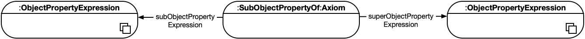


#### 6.2.2 Equivalent Object Properties

An equivalent object properties axiom `EquivalentObjectProperties( OPE1 ... OPEn )` states that all of the object property expressions `OPEi`, 1 ≤ i ≤ n, are semantically equivalent to each other. This axiom allows one to use each `OPEi` as a synonym for each `OPEj` — that is, in any expression in the ontology containing such an axiom, `OPEi` can be replaced with `OPEj` without affecting the meaning of the ontology.

<u>OWL 2 Notation</u>:

​	**EquivalentObjectProperties** := 'EquivalentObjectProperties' '(' { **Annotation** } **ObjectPropertyExpression** **ObjectPropertyExpression** { **ObjectPropertyExpression** } ')'

<u>LPG Diagram</u>:

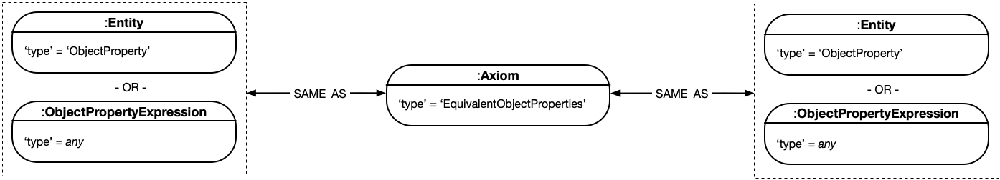


#### 6.2.3 Disjoint Object Properties

A disjoint object properties axiom `DisjointObjectProperties( OPE1 ... OPEn )` states that all of the object property expressions `OPEi`, 1 ≤ i ≤ n, are pairwise disjoint; that is, no individual `x` can be connected to an individual `y` by both `OPEi` and `OPEj` for i ≠ j.

<u>OWL 2 Notation</u>:

​	**DisjointObjectProperties** := 'DisjointObjectProperties' '(' { **Annotation** } **ObjectPropertyExpression** **ObjectPropertyExpression** { **ObjectPropertyExpression** } ')'

<u>LPG Diagram</u>:

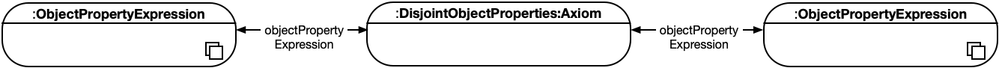


#### 6.2.4 Inverse Object Properties

An inverse object properties axiom `InverseObjectProperties( OPE1 OPE2 )` states that the object property expression `OPE1` is an inverse of the object property expression `OPE2`. Thus, if an individual `x` is connected by `OPE1` to an individual `y`, then `y` is also connected by `OPE2` to `x`, and vice versa.

<u>OWL 2 Notation</u>:

​	**InverseObjectProperties** := 'InverseObjectProperties' '(' { **Annotation** } **ObjectPropertyExpression** **ObjectPropertyExpression** ')'

<u>LPG Diagram</u>:

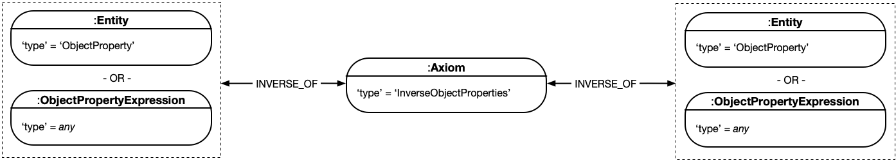


#### 6.2.5 Object Property Domain

An object property *domain* axiom `ObjectPropertyDomain( OPE CE )` states that the domain of the object property expression `OPE` is the class expression `CE` — that is, if an individual `x` is connected by `OPE` with some other individual, then `x` is an instance of `CE`.

<u>OWL 2 Notation</u>:

​	**ObjectPropertyDomain** := 'ObjectPropertyDomain' '(' { **Annotation** } **ObjectPropertyExpression** **ClassExpression** ')'

<u>LPG Diagram</u>:

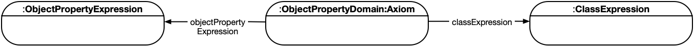


#### 6.2.6 Object Property Range

An object property *range* axiom `ObjectPropertyRange( OPE CE )` states that the range of the object property expression `OPE` is the class expression `CE` — that is, if some individual is connected by `OPE` with an individual `x`, then `x` is an instance of `CE`. 

<u>OWL 2 Notation</u>:

​	**ObjectPropertyRange** := 'ObjectPropertyRange' '(' { **Annotation** } **ObjectPropertyExpression** **ClassExpression** ')'

<u>LPG Diagram</u>:


#### 6.2.7 Functional Object Property

An object property *functionality* axiom `FunctionalObjectProperty( OPE )` states that the object property expression `OPE` is functional — that is, for each individual `x`, there can be at most one distinct individual `y` such that `x` is connected by `OPE` to `y`.

<u>OWL 2 Notation</u>:

​	**FunctionalObjectProperty** := 'FunctionalObjectProperty' '(' { **Annotation** } **ObjectPropertyExpression** ')'

<u>LPG Diagram</u>:


#### 6.2.8 Inverse Functional Object Property

An object property *inverse functionality* axiom `InverseFunctionalObjectProperty( OPE )` states that the object property expression `OPE` is inverse-functional — that is, for each individual `x`, there can be at most one individual `y` such that `y` is connected by `OPE` with `x`.

<u>OWL 2 Notation</u>:

​	**InverseFunctionalObjectProperty** := 'InverseFunctionalObjectProperty' '(' { **Annotation** } **ObjectPropertyExpression** ')'

<u>LPG Diagram</u>:

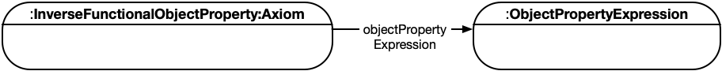


#### 6.2.9 Reflexive Object Property

An object property *reflexivity* axiom `ReflexiveObjectProperty( OPE )` states that the object property expression `OPE` is reflexive — that is, each individual is connected by `OPE` to itself.

<u>OWL 2 Notation</u>:

​	**ReflexiveObjectProperty** := 'ReflexiveObjectProperty' '(' { **Annotation** } **ObjectPropertyExpression** ')'

<u>LPG Diagram</u>:


#### 6.2.10 Irreflexive Object Property

An object property *irreflexivity* axiom `IrreflexiveObjectProperty( OPE )` states that the object property expression `OPE` is irreflexive — that is, no individual is connected by `OPE` to itself.

<u>OWL 2 Notation</u>:

​	**IrreflexiveObjectProperty** := 'IrreflexiveObjectProperty' '(' { **Annotation** } **ObjectPropertyExpression** ')'

<u>LPG Diagram</u>:


#### 6.2.11 Symmetric Object Property

An object property *symmetry* axiom `SymmetricObjectProperty( OPE )` states that the object property expression `OPE` is symmetric — that is, if an individual `x` is connected by `OPE` to an individual `y`, then `y` is also connected by `OPE` to `x`.

<u>OWL 2 Notation</u>:

​	**SymmetricObjectProperty** := 'SymmetricObjectProperty' '(' { **Annotation** } **ObjectPropertyExpression** ')'

<u>LPG Diagram</u>:

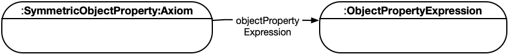


#### 6.2.12 Asymmetric Object Property

An object property *asymmetry* axiom `AsymmetricObjectProperty( OPE )` states that the object property expression `OPE` is asymmetric — that is, if an individual `x` is connected by `OPE` to an individual `y`, then `y` cannot be connected by `OPE` to `x`.

<u>OWL 2 Notation</u>:

​	**AsymmetricObjectProperty** := 'AsymmetricObjectProperty' '(' { **Annotation** } **ObjectPropertyExpression** ')'

<u>LPG Diagram</u>:

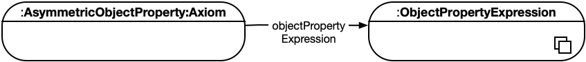


#### 6.2.13 Transitive Object Property

An object property *transitivity* axiom `TransitiveObjectProperty( OPE )` states that the object property expression `OPE` is transitive — that is, if an individual `x` is connected by `OPE` to an individual `y` that is connected by `OPE` to an individual `z`, then `x` is also connected by `OPE` to `z`.

<u>OWL 2 Notation</u>:

​	**TransitiveObjectProperty** := 'TransitiveObjectProperty' '(' { **Annotation** } **ObjectPropertyExpression** ')'

<u>LPG Diagram</u>:

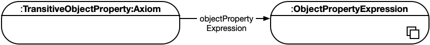


### 6.3 Data Property Axioms

#### 6.3.1 Data Subproperties

A data subproperty axiom `SubDataPropertyOf( DP1 DP2 )` states that the data property `DP1` is a subproperty of the data property `DP2` — that is, if an individual `x` is connected by `DP1` to a literal `y`, then `x` is connected by `DP2` to `y` as well.

<u>OWL 2 Notation</u>:

​	**SubDataPropertyOf** := 'SubDataPropertyOf' '(' { **Annotation** } **subDataProperty** **superDataProperty** ')'

​	**subDataProperty** := **DataProperty**

​	**superDataProperty** := **DataProperty**

<u>LPG Diagram</u>:

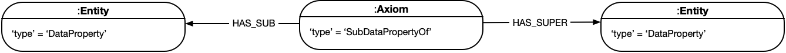


#### 6.3.2 Equivalent Data Properties

An equivalent data properties axiom `EquivalentDataProperties( DP1 ... DPn )` states that all the data property `DPi`, 1 ≤ i ≤ n, are semantically equivalent to each other. This axiom allows one to use each `DPi` as a synonym for each `DPj` — that is, in any expression in the ontology containing such an axiom, `DPi` can be replaced with `DPj` without affecting the meaning of the ontology. 

<u>OWL 2 Notation</u>:

​	**EquivalentDataProperties** := 'EquivalentDataProperties' '(' { **Annotation** } **DataProperty** **DataProperty** { **DataProperty** } ')'

<u>LPG Diagram</u>:

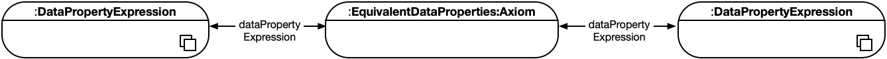


#### 6.3.3 Disjoint Data Properties

A disjoint data properties axiom `DisjointDataProperties( DP1 ... DPn )` states that all of the data property `DPi`, 1 ≤ i ≤ n, are pairwise disjoint; that is, no individual `x` can be connected to a literal `y` by both `DPi` and `DPj` for i ≠ j.

<u>OWL 2 Notation</u>:

​	**DisjointDataProperties** := 'DisjointDataProperties' '(' { **Annotation** } **DataProperty** **DataProperty** { **DataProperty** } ')'

<u>LPG Diagram</u>:

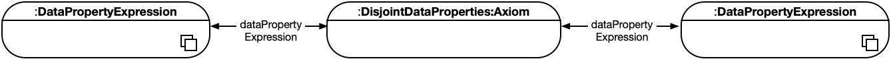


#### 6.3.4 Data Property Domain

A data property domain axiom `DataPropertyDomain( DP CE )` states that the domain of the data property  `DP` is the class expression `CE` — that is, if an individual `x` is connected by `DP` with some literal, then `x` is an instance of `CE`.

<u>OWL 2 Notation</u>:

​	**DataPropertyDomain** := 'DataPropertyDomain' '(' { **Annotation** } **DataProperty** **ClassExpression** ')'

<u>LPG Diagram</u>:

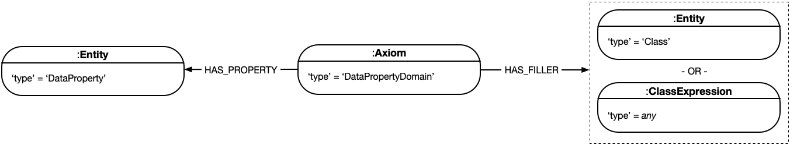


#### 6.3.5 Data Property Range

A data property range axiom `DataPropertyRange( DP DR )` states that the range of the data property `DP` is the data range `DR` — that is, if some individual is connected by `DP` with a literal `x`, then `x` is in `DR`. The arity of `DR` *must* be one. 

<u>OWL 2 Notation</u>:

​	**DataPropertyRange** := 'DataPropertyRange' '(' { **Annotation** } **DataProperty** **DataRange** ')'

<u>LPG Diagram</u>:


#### 6.3.6 Functional Data Properties

A data property functionality axiom `FunctionalDataProperty( DP )` states that the data property `DP` is functional — that is, for each individual `x`, there can be at most one distinct literal `y` such that `x` is connected by `DP` with `y`.

<u>OWL 2 Notation</u>:

​	**FunctionalDataProperty** := 'FunctionalDataProperty' '(' { **Annotation** } **DataProperty** ')'

<u>LPG Diagram</u>:


### 6.4 Assertions

#### 6.4.1 Class Assertions

A class assertion `ClassAssertion( CE a )` states that the individual `a` is an instance of the class expression `CE`.

<u>OWL 2 Notation</u>:

​	**ClassAssertion** := 'ClassAssertion' '(' { **Annotation** } **ClassExpression** **Individual** ')'

<u>LPG Diagram</u>:


#### 6.4.2 Positive Object Property Assertions

A positive object property assertion `ObjectPropertyAssertion( OPE a1 a2 )` states that the individual `a1` is connected by the object property expression `OPE` to the individual `a2`.

<u>OWL 2 Notation</u>:

​	**ObjectPropertyAssertion** := 'ObjectPropertyAssertion' '(' { **Annotation** } **ObjectPropertyExpression** **sourceIndividual** **targetIndividual** ')'

<u>LPG Diagram</u>:


#### 6.4.3 Negative Object Property Assertions

A negative object property assertion `NegativeObjectPropertyAssertion( OPE a1 a2 )` states that the individual `a1` is not connected by the object property expression `OPE` to the individual `a2`.

<u>OWL 2 Notation</u>:

​	**NegativeObjectPropertyAssertion** := 'NegativeObjectPropertyAssertion' '(' { **Annotation** } **ObjectPropertyExpression** **sourceIndividual** **targetIndividual** ')'

<u>LPG Diagram</u>:


#### 6.4.4 Positive Data Property Assertions

A positive data property assertion `DataPropertyAssertion( DP a lt )` states that the individual a is connected by the data property `DP` to the literal `lt`.

<u>OWL 2 Notation</u>:

​	**DataPropertyAssertion** := 'DataPropertyAssertion' '(' { **Annotation** } **DataPropertyExpression** **sourceIndividual** **targetValue** ')'

<u>LPG Diagram</u>:


#### 6.4.5 Negative Data Property Assertions

A negative data property assertion `NegativeDataPropertyAssertion( DP a lt )` states that the individual a is not connected by the data property `DP` to the literal `lt`.

<u>OWL 2 Notation</u>:

​	**NegativeDataPropertyAssertion** := 'NegativeDataPropertyAssertion' '(' { **Annotation** } **DataPropertyExpression** **sourceIndividual** **targetValue** ')'	

<u>LPG Diagram</u>:


#### 6.4.6 Individual Equality

An individual equality axiom `SameIndividual( a1 ... an )` states that all of the individuals `ai`, 1 ≤ i ≤ n, are equal to each other. This axiom allows one to use each `ai` as a synonym for each `aj` — that is, in any expression in the ontology containing such an axiom, `ai` can be replaced with `aj` without affecting the meaning of the ontology.

<u>OWL 2 Notation</u>:

​	**SameIndividual** := 'SameIndividual' '(' { **Annotation** } **Individual** **Individual** { **Individual** } ')'

<u>LPG Diagram</u>:


#### 6.4.7 Individual Inequality

An individual inequality axiom `DifferentIndividuals( a1 ... an )` states that all of the individuals `ai`, 1 ≤ i ≤ n, are different from each other; that is, no individuals `ai` and `aj` with i ≠ j can be derived to be equal. This axiom can be used to axiomatize the *unique name assumption* — the assumption that all different individual names denote different individuals.

<u>OWL 2 Notation</u>:

​	**DifferentIndividuals** := 'DifferentIndividuals' '(' { **Annotation** } **Individual** **Individual** { **Individual** } ')'

<u>LPG Diagram</u>:


## 7 Annotations

### 7.1 Annotation of Ontologies, Axioms, and other Annotations

Ontologies, axioms, and annotations themselves can be annotated using annotations. Such annotations consist of an annotation property and an annotation value, where the latter can be anonymous individuals, IRIs, and literals.

<u>OWL 2 Notation</u>:

​	**Annotation** := 'Annotation' '(' **annotationAnnotations**  **AnnotationProperty** **AnnotationValue** ')'

​	**annotationAnnotations** := { **Annotation** }

​	**AnnotationValue** := **AnonymousIndividual** | **IRI** | **Literal** 

<u>LPG Diagram</u>:


### 7.2 Annotation Axioms

#### 7.2.1 Annotation Assertions

An annotation assertion `AnnotationAssertion( AP as av )` states that the annotation subject `as` — an IRI or an anonymous individual — is annotated with the annotation property `AP` and the annotation value `av`.

<u>OWL 2 Notation</u>:

​	**AnnotationAssertion** := 'AnnotationAssertion' '(' { **Annotation** } **AnnotationProperty** **AnnotationSubject** **AnnotationValue** ')'

​	**AnnotationSubject** := **IRI** | **AnonymousIndividual**

​	**AnnotationValue** := **AnonymousIndividual** | **IRI** | **Literal** 

<u>LPG Diagram</u>:


#### 7.2.2 Annotation Subproperties

An annotation subproperty axiom `SubAnnotationPropertyOf( AP1 AP2 )` states that the annotation property `AP1` is a subproperty of the annotation property `AP2`.

<u>OWL 2 Notation</u>:

​	**SubAnnotationPropertyOf** := 'SubAnnotationPropertyOf' '(' { **Annotation** } **subAnnotationProperty** **superAnnotationProperty** ')'

​	**subAnnotationProperty** := **AnnotationProperty**

​	**superAnnotationProperty** := **AnnotationProperty**

<u>LPG Diagram</u>:


#### 7.2.3 Annotation Property Domain

An annotation property domain axiom `AnnotationPropertyDomain( AP U )` states that the domain of the annotation property `AP` is the IRI `U`.

<u>OWL 2 Notation</u>:

​	**AnnotationPropertyDomain** := 'AnnotationPropertyDomain' '(' **axiomAnnotations** **AnnotationProperty** **IRI** ')'

<u>LPG Diagram</u>:


#### 7.2.4 Annotation Property Range

An annotation property range axiom `AnnotationPropertyRange( AP U )` states that the range of the annotation property `AP` is the IRI `U`.

<u>OWL 2 Notation</u>:

​	**AnnotationPropertyRange** := 'AnnotationPropertyRange' '(' **axiomAnnotations** **AnnotationProperty** **IRI** ')'

<u>LPG Diagram</u>:


