# Mapping of OWL 2 Web Ontology Language to Labeled Property Graphs (OWL2LPG)

Working Draft, Updated: 13 March 2020


**Feedback**:

​	[rafael.goncalves@stanford.edu](mailto:rafael.goncalves@stanford.edu)

​	[josef.hardi@stanford.edu](mailto:josef.hardi@stanford.edu)

**Document Source Control**:

​	[GitHub](https://github.com/protegeproject/owl2lpg/) (in branch: [gh-pages-markdown](https://github.com/protegeproject/owl2lpg/tree/gh-pages-markdown))

**Issue Tracking**:

​	[GitHub](https://github.com/protegeproject/owl2lpg/issues/)

**Editors**:

​	[Rafael Gonçalves](https://rsgoncalves.com) (Stanford University)

​	[Josef Hardi](https://profiles.stanford.edu/josef-hardi) (Stanford University)

​	[Matthew Horridge](https://web.stanford.edu/~horridge) (Stanford University)

**Contributors**:

​	[Alexander García Castro](mailto:alexander.garcia-castro@basf.com) (BASF)

​	[José Antonio Bernabé Díaz](mailto:jose-antonio.bernabe-diaz@basf.com) (BASF)

​	[Juergen Mueller](mailto:juergen.a.mueller@basf.com) (BASF)

---


## Abstract

This document specificies a mapping of OWL 2 Web Ontology Language to Labeled Property Graphs (LPGs), and vice versa.


## Status of this document

This is a public copy of the editors’ draft. It is provided for discussion only and may change at any moment. Do not cite this document other than as work in progress.


---

**Table of Content**

 * [1 Introduction](#1-introduction)
    * [1.1 Main Requirements](#11-main-requirements)
       * [1.1.1 Tooling Requirements](#111-tooling-requirements)
       * [1.1.2 BASF Use-Case Requirements](#112-basf-use-case-requirements)
    * [1.2 Design Choices](#12-design-choices)
    * [1.3 Document Conventions](#13-document-conventions)
       * [1.3.1 Reserved Nodes](#131-reserved-nodes)
       * [1.3.2 Reserved Keywords](#132-reserved-keywords)
       * [1.3.3 Reading the Node](#133-reading-the-node)
    * [1.4 Similar Works](#14-similar-works)
       * [1.4.1 SciGraph](#141-scigraph)
       * [1.4.2 VirtualFlyBrain](#142-virtualflybrain)
       * [1.4.3 OWL2Neo4J](#143-owl2neo4j)
 * [2 Class Expressions](#2-class-expressions)
    * [2.1 Propositional Connectives and Enumeration of Individuals](#21-propositional-connectives-and-enumeration-of-individuals)
       * [2.1.1 Intersection and Union of Class Expressions](#211-intersection-and-union-of-class-expressions)
       * [2.1.2 Complement of Class Expressions](#212-complement-of-class-expressions)
       * [2.1.3 Enumeration of Individuals](#213-enumeration-of-individuals)
    * [2.2 Object Property Restrictions](#22-object-property-restrictions)
       * [2.2.1 Existential and Universal Quantification](#221-existential-and-universal-quantification)
       * [2.2.2 Individual Value Restriction](#222-individual-value-restriction)
       * [2.2.3 Self-Restriction](#223-self-restriction)
    * [2.3 Object Property Cardinality Restrictions](#23-object-property-cardinality-restrictions)
    * [2.4 Data Property Restrictions](#24-data-property-restrictions)
       * [2.4.1 Existential and Universal Quantification](#241-existential-and-universal-quantification)
       * [2.4.2 Literal Value Restriction](#242-literal-value-restriction)
    * [2.5 Data Property Cardinality Restrictions](#25-data-property-cardinality-restrictions)
 * [3 Data Ranges](#3-data-ranges)
    * [3.1 Intersection and Union of Data Ranges](#31-intersection-and-union-of-data-ranges)
    * [3.2 Complement of Data Ranges](#32-complement-of-data-ranges)
    * [3.3 Enumeration of Literals](#33-enumeration-of-literals)
    * [3.4 Datatype Restrictions](#34-datatype-restrictions)
 * [4 Axioms](#4-axioms)
    * [4.1 Class Expression Axioms](#41-class-expression-axioms)
       * [4.1.1 Subclass](#411-subclass)
       * [4.1.2 Equivalent Classes](#412-equivalent-classes)
       * [4.1.3 Disjoint Classes](#413-disjoint-classes)
    * [4.2 Object Property Axioms](#42-object-property-axioms)
       * [4.2.1 Object Subproperties](#421-object-subproperties)
       * [4.2.2 Equivalent Object Properties](#422-equivalent-object-properties)
       * [4.2.3 Disjoint Object Properties](#423-disjoint-object-properties)
       * [4.2.4 Inverse Object Properties](#424-inverse-object-properties)
       * [4.2.5 Object Property Domain and Range](#425-object-property-domain-and-range)
       * [4.2.6 Object Property Characteristics](#426-object-property-characteristics)
    * [4.3 Data Property Axioms](#43-data-property-axioms)
       * [4.3.1 Data Subproperties](#431-data-subproperties)
       * [4.3.2 Equivalent Data Properties](#432-equivalent-data-properties)
       * [4.3.3 Disjoint Data Properties](#433-disjoint-data-properties)
       * [4.3.4 Data Property Domain](#434-data-property-domain)
       * [4.3.5 Data Property Range](#435-data-property-range)
       * [4.3.6 Functional Data Properties](#436-functional-data-properties)
    * [4.4 Assertions](#44-assertions)
       * [4.4.1 Class Assertions](#441-class-assertions)
       * [4.4.2 Object Property Assertions](#442-object-property-assertions)
       * [4.4.3 Data Property Assertions](#443-data-property-assertions)
       * [4.4.4 Individual Equality](#444-individual-equality)
       * [4.4.5 Individual Inequality](#445-individual-inequality)
 * [5 Annotations](#5-annotations)
    * [5.1 Annotation of Ontologies, Axioms, and other Annotations](#51-annotation-of-ontologies-axioms-and-other-annotations)
    * [5.2 Annotation Axioms](#52-annotation-axioms)
       * [5.2.1 Annotation Assertions](#521-annotation-assertions)
       * [5.2.2 Annotation Subproperties](#522-annotation-subproperties)
 * [6 Change History](#6-change-history)

---


## 1 Introduction

This document specifies a mapping of OWL 2 axioms to a Labeled Property Graph (LPG) representation, and vice-versa.


### 1.1 Main Requirements

In this section we lay out important requirements that drive the design of the OWL to LPG mapping.

#### 1.1.1 Tooling Requirements

Here we enumerate illustrative examples of the kinds of queries that should be both easily expressible (in [Cypher](https://neo4j.com/developer/cypher-query-language)) and well performant for large knowledge bases. We use the [WebProtégé cloud-based ontology editor](https://webprotege.stanford.edu) as the baseline for performance. The goal is to achieve a query performance that is superior to the performance of executing the same queries in WebProtégé 4.0 (non-LPG).

Example queries:
1. Get the axioms in a frame for class `A`.
2. Get the axioms that mention `A`.
3. Get the revisions for an ontology `O`.
4. Get the revisions that alter the frame for `A`.
5. Get the authors of changes to `A`.
6. Get the last changes for `A`.
7. Get the axioms in the latest revision of `O`.

#### 1.1.2 BASF Use-Case Requirements

TBA


### 1.2 Design Choices

Our overarching design principle is to prioritize representational **consistency over convenience** (of query writing, of query response time, etc.). Below we describe in detail some key design choices:

- **The types of OWL objects are specified by a property value in a LPG**. Each OWL object is identified through a *reserved keyword* (see [1.3.2 Reserved Keywords](#132-reserved-keywords)) that satisfies the `type` property of a node. For example, the `'type' = 'Class'` pair indicates a node that represents an OWL Class entity in the graph. This  *type-of* method will provide the node the neccessary abstraction to deal with various complex structural constructions in the OWL language specification.

- **Complex OWL constructs (e.g., class expression, axioms, data ranges) are depicted as a node with outgoing edges**. Depending on the type of the complex construction, the outgoing edge can be linked to a node or to another complex construction. For example, the OWL SubClassOf axiom will have one `Axiom` node (i.e., with a type equals to 'SubClassOf') and two outgoing edges (i.e., `HAS_SUB` and `HAS_SUPER`) that link to an `Entity` node (i.e., with a type equals to 'Class') or to a complex construction of *any* `ClassExpression` node, in any combinations.

- **Each named OWL entity is mapped to a unique  `Entity` node in a LPG.** The OWL 2 specification defines 6 types of entity: class, object property, data property, annotation property, individual and datatype. OWL entities of each of these types are mapped to a unique node in a LPG, which is reused throughout the entire ontology development, i.e., when the user adds new entity expressions or new axioms. In case the user deletes an entity, a status flag (e.g., `'status' = 'defunct'`) can be used to indicate the removal instead of actually removing the node itself. At this point, the entity cannot accept any incoming edges. If the user then introduce the same entity, a *new* entity node will be created and it can be reused until it gets decommissioned again. (Note: A node cannot be restored once it gets the `defunct` status flag).

  For example, consider the axioms: 

	```
	AX1: A SubClassOf p some B
	AX2: A SubClassOf p some C
	AX3: B SubClassOf D
	```

	The entity node `A` will be reused (and shared) by `AX1` and `AX2`, and the entity node `B` will be reused (and shared) by `AX1` and `AX3`. If the user deletes the entity node `A` then the axioms `AX1` and `AX2` will be removed as well because node `A` cannot receive the incoming edges `HAS_SUB` from those axioms. After the operation, the axiom `AX3` will become the only remaining axiom, along with the entity nodes `p`, `B`, `C` and `D`.
	
	


### 1.3 Document Conventions

The OWL 2 Web Ontology Language notations are written in [OWL Functional-Style syntax](https://www.w3.org/TR/owl2-syntax).

The Labelled Property Graphs diagram consists of nodes and edges. A node is depicted as a round edge rectangle and an edge is depicted as either a 1-directional arrow or a bi-directional arrow.

#### 1.3.1 Reserved Nodes

We have reserved 11 labelled nodes to construct an LPG:

1. Ontology
2. Entity
3. ClassExpression
4. ObjectPropertyExpression
5. Axiom
6. Value
8. DataRange
8. Facet
9. Revision
10. Operation
11. Person

The first 8 labelled nodes are used to construct an OWL 2 ontology, the `Revision` and `Operation` nodes are for building the change history graph, and lastly the node `Person` is used to store information about authorship.

#### 1.3.2 Reserved Keywords

We have reserved several keywords used to fill out the `type` property to indicate the OWL object's specific type. The table below shows the complete list:

| Node                       | Reserved keywords                                            |
| -------------------------- | ------------------------------------------------------------ |
| `Entity`                   | Class<br />DataProperty<br />ObjectProperty<br />AnnotationProperty<br />Individual<br />Datatype |
| `ClassExpression`          | ObjectSomeValuesFrom<br />ObjectAllValuesFrom<br />ObjectHasValue<br />ObjectHasSelf<br />ObjectOneOf<br />ObjectIntersectionOf<br />ObjectUnionOf<br />ObjectComplementOf<br />ObjectMinCardinality<br />ObjectMaxCardinality<br />ObjectExactCardinality<br />DataSomeValuesFrom<br />DataAllValuesFrom<br />DataHasValue<br />DataMinCardinality<br />DataMaxCardinality<br />DataExactCardinality |
| `ObjectPropertyExpression` | ObjectInverseOf                                              |
| `Axiom`                    | SubClassOf<br />EquivalentClasses<br />DisjointClasses<br />DisjointUnion<br />SubObjectPropertyOf<br />EquivalentObjectProperties<br />DisjointObjectProperties<br />InverseObjectProperties<br />ObjectPropertyDomain<br />ObjectPropertyRange<br />FunctionalObjectProperties<br />InverseFunctionalObjectProperties<br />ReflexiveObjectProperties<br />IrreflexiveObjectProperties<br />SymmetricObjectProperties<br />AsymmetricObjectProperties<br />TransitiveObjectProperties<br />SubDataPropertyOf<br />EquivalentDataProperties<br />DisjointDataProperties<br />DataPropertyDomain<br />DataPropertyRange<br />FunctionalDataProperty<br />DatatypeDefinition<br />HasKey<br />SameIndividual<br />DifferentIndividual<br />ClassAssertion<br />ObjectPropertyAssertion<br />NegativeObjectPropertyAssertion<br />DataPropertyAssertion<br />NegativeDataPropertyAssertion |
| `Value`                    | Literal<br />IRI                                             |
| `DataRange`                | DataIntersectionOf<br />DataUnionOf<br />DataComplementOf<br />DataOneOf<br />DatatypeRestriction |


#### 1.3.3 Reading the Node

Some nodes will have a `type` property to represent the *kind* of OWL objects. For example, the figure below indicates that the Entity node represents the OWL Class entity. The 'Class' string is a *reserved keyword* in the specification. 

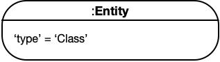

A node can have several keywords separated by a pipe (`|`) delimiter. For example, the figure below indicates that the Axiom node can be one of the object property characteristics.

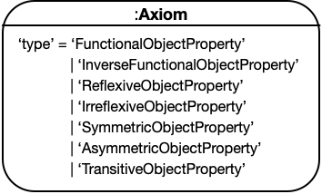

Moreover, if the node has `'type' = any` then it means the value can be any keyword that the node can support. For example, the figure below indicates the Entity node can be any kind of OWL entities (i.e., Class, Data Property, Object Property, Annotation Property, Individual or Datatype).

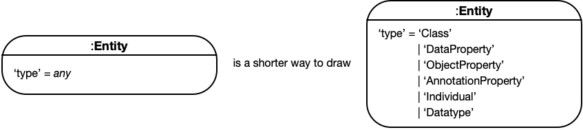


### 1.4 Similar Works

In this section we compare and contrast the mapping described in this document with existing approaches to transform OWL ontologies to LPGs.

#### 1.4.1 SciGraph

The [SciGraph Neo4j Mapping](https://github.com/SciGraph/SciGraph/wiki/Neo4jMapping) aims to support representing multiple ontologies as a Labeled Property Graph. SciGraph reads ontologies with the OWL API and converts them to a LPG. *SciGraph does not aim to support creating ontologies based on the LPG.* Below we outline and briefly describe the main differences between ours and the SciGraph mapping.

- **OWL axiom types are represented as edges in a LPG.** In the SciGraph mapping, axiom types such as `rdfs:subClassOf` are encoded as edges between nodes that represent the left and the right hand side of the axiom. Axiom annotations are represented as key-value string properties on the edge that denotes the axiom type. In our mapping, axiom types are represented as nodes, and therefore axiom annotations are represented uniformly like other annotation assertions.
- **Annotation assertions are represented as key-value string properties in a LPG.** For example, `i:Individual {'rdfs:label' = 'Ruth'}`. As a consequence, annotations on annotations are not straightforwardly representable in SciGraph.
- **Representation of source ontology in SciGraph is done both at the node and edge level of a LPG.** In the SciGraph mapping, nodes have an outgoing edge named `isDefinedBy` to a node of type `Ontology` that denotes the source ontology, and edges have a key-value string property to denote the source ontology IRI. In our mapping, the source ontology of axioms will be encoded as a node connected to the nodes denoting the axiom types (e.g., `rdfs:SubClassOf, owl:EquivalentClasses`).
- **SciGraph represents OWL properties as both nodes and edges in a LPG.** It represents OWL property types (functional, symmetric, etc.) as key-value properties on LPG **nodes** that represent the OWL properties (e.g., `hasSibling:ObjectProperty {'symmetric' = true}`). And then SciGraph uses OWL properties as **edges** in axioms such as object property assertions (e.g., `rafael:Individual --hasSibling:ObjectProperty --> ruth:Individual`. In our mapping, we consistently represent OWL properties as nodes. More, we represent OWL property characteristics similarly to the OWL/XML and Functional-style syntaxes of OWL. E.g., `hasSibling:ObjectProperty --> SymmetricObjectProperty:Axiom`.

#### 1.4.2 VirtualFlyBrain
The [VirtualFlyBrain OWL 2 EL to Neo4J Mapping](https://github.com/VirtualFlyBrain/neo4j2owl) allows importing "a well defined subset of OWL 2 EL ontologies into and export them from Neo4J, in such a way that entailments and annotations are preserved (not however the syntactic structure) in the ontology after the round-trip." The VirtualFlyBrain (VFB) mapping is explicit about its design goal of facilitating intuitive writing of Cypher queries. In that sense, VFB does not create "anonymous" nodes to represent axiom types or class expression types, and instead encodes these details on edges (relying on both edge names and key-value string properties on edges).

- **Object property names and axiom types are encoded as edge names.** For example, the axioms: `A SubClassOf B. A SubClassOf r some C` would be encoded in LPG as: `A--SubClassOf-->B. A--r-->B`. The restriction qualifiers (or quantifiers) are encoded as key-value properties on edges.
- **The VFB mapping represents OWL properties as both nodes and edges.** Similar to SciGraph, OWL object properties are represented as edges, and then they are also represented as nodes to be able to express axioms such as annotations on those properties.
- **Data and Annotation property assertions are represented as key-value string properties.** Also similar to SciGraph, both data and annotation property assertions are represented as key-value string properties on nodes. As a consequence, annotations on annotations are not straightforwardly representable in VFB.

#### 1.4.3 OWL2Neo4J

The [OWL2Neo4J tool](https://github.com/flekschas/owl2neo4j) allows converting OWL ontologies to Labeled Property Graphs. The tool documentation states that it "only converts the class hierarchy; instances are ignored for now." Overall it is unclear what subset of the OWL language is supported, and whether round-tripping is feasible. This project looks defunct—it was last updated on September 2018.


## 2 Class Expressions

### 2.1 Propositional Connectives and Enumeration of Individuals

#### 2.1.1 Intersection and Union of Class Expressions

An *intersection* class expression `ObjectIntersectionOf( CE1 ... CEn )` contains all individuals that are instances of all class expressions `CEi` for 1 ≤ i ≤ n.

A *union* class expression `ObjectUnionOf( CE1 ... CEn )` contains all individuals that are instances of at least one class expression `CEi` for 1 ≤ i ≤ n.

<u>OWL 2 Notation</u>:

​	**ObjectIntersectionOf** := 'ObjectIntersectionOf' '(' **ClassExpression** **ClassExpression** ')'

​	**ObjectUnionOf** := 'ObjectUnionOf' '(' **ClassExpression** **ClassExpression** ')'

<u>LPG Diagram</u>:

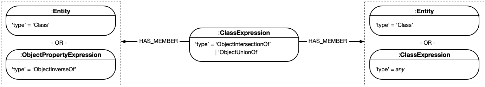


#### 2.1.2 Complement of Class Expressions

A complement class expression `ObjectComplementOf( CE )` contains all individuals that are not instances of the class expression `CE`.

<u>OWL 2 Notation</u>:

​	**ObjectComplementOf** := 'ObjectComplementOf' '(' **ClassExpression** ')'

<u>LPG Diagram</u>:


#### 2.1.3 Enumeration of Individuals

An enumeration of individuals `ObjectOneOf( a1 ... an )` contains exactly the individuals `ai` with 1 ≤ i ≤ n.

<u>OWL 2 Notation</u>:

​	**ObjectOneOf** := 'ObjectOneOf' '(' **Individual** { **Individual** }')'

<u>LPG Diagram</u>:


### 2.2 Object Property Restrictions

#### 2.2.1 Existential and Universal Quantification

An *existential* class expression `ObjectSomeValuesFrom( OPE CE )` consists of an object property expression `OPE` and a class expression `CE`, and it contains all those individuals that are connected by `OPE` to an individual that is an instance of `CE`. 

A *universal* class expression `ObjectAllValuesFrom( OPE CE )` consists of an object property expression `OPE` and a class expression `CE`, and it contains all those individuals that are connected by `OPE` only to individuals that are instances of `CE`. 

<u>OWL 2 Notation</u>:

​	**ObjectSomeValuesFrom** := 'ObjectSomeValuesFrom' '(' **ObjectPropertyExpression** **ClassExpression** ')'

​	**ObjectAllValuesFrom** := 'ObjectAllValuesFrom' '(' **ObjectPropertyExpression** **ClassExpression** ')'

<u>LPG Diagram</u>:

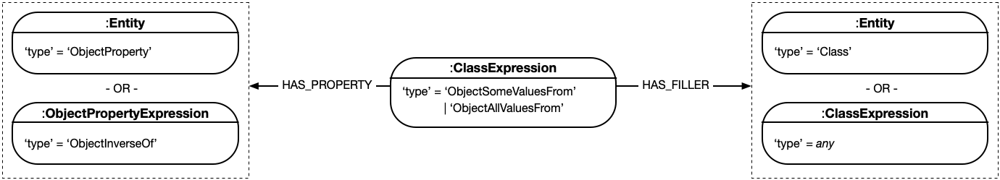


#### 2.2.2 Individual Value Restriction

A has-value class expression `ObjectHasValue( OPE a )` consists of an object property expression `OPE` and an individual a, and it contains all those individuals that are connected by `OPE` to `a`. 

<u>OWL 2 Notation</u>:

​	**ObjectHasValue** := 'ObjectHasValue' '(' **ObjectPropertyExpression** **Individual** ')'

<u>LPG Diagram</u>:


#### 2.2.3 Self-Restriction

A self-restriction `ObjectHasSelf( OPE )` consists of an object property expression `OPE`, and it contains all those individuals that are connected by `OPE` to themselves.

<u>OWL 2 Notation</u>:

​	**ObjectHasSelf** := 'ObjectHasSelf' '(' **ObjectPropertyExpression** ')'

<u>LPG Diagram</u>:


### 2.3 Object Property Cardinality Restrictions

A *minimum cardinality* expression `ObjectMinCardinality( n OPE CE )` consists of a nonnegative integer `n`, an object property expression `OPE`, and a class expression `CE`, and it contains all those individuals that are connected by `OPE` to at least `n` different individuals that are instances of `CE`.

A *maximum cardinality* expression `ObjectMaxCardinality( n OPE CE )` consists of a nonnegative integer `n`, an object property expression `OPE`, and a class expression `CE`, and it contains all those individuals that are connected by `OPE` to at most `n` different individuals that are instances of `CE`.

An *exact cardinality* expression `ObjectExactCardinality( n OPE CE )` consists of a nonnegative integer `n`, an object property expression `OPE`, and a class expression `CE`, and it contains all those individuals that are connected by `OPE` to exactly `n` different individuals that are instances of `CE`.

In all cases, if `CE` is missing, it is taken to be *owl:Thing*.

<u>OWL 2 Notation</u>:

​	**ObjectMinCardinality** := 'ObjectMinCardinality' '(' **nonNegativeInteger** **ObjectPropertyExpression** [ **ClassExpression** ] ')'

​	**ObjectMaxCardinality** := 'ObjectMaxCardinality' '(' **nonNegativeInteger** **ObjectPropertyExpression** [ **ClassExpression** ] ')'

​	**ObjectExactCardinality** := 'ObjectExactCardinality' '(' **nonNegativeInteger** **ObjectPropertyExpression** [ **ClassExpression** ] ')'

<u>LPG Diagram</u>:

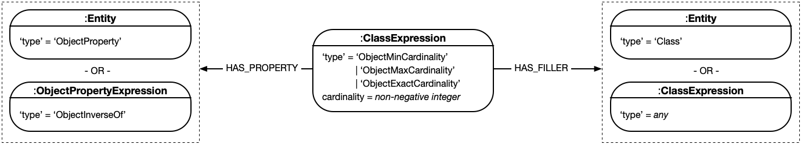


### 2.4 Data Property Restrictions

#### 2.4.1 Existential and Universal Quantification

An *existential* class expression `DataSomeValuesFrom( DP1 ... DPn DR )` consists of `n` data properties `DPi`, 1 ≤ i ≤ n, and a data range `DR` whose arity *must* be `n`. Such a class expression contains all those individuals that are connected by `DPi` to literals `lti`, 1 ≤ i ≤ n, such that the tuple `( lt1 , ..., ltn )` is in `DR`.

A *universal* class expression `DataAllValuesFrom( DP1 ... DPn DR )` consists of `n` data properties `DPi`, 1 ≤ i ≤ n, and a data range `DR` whose arity *must* be `n`. Such a class expression contains all those individuals that are connected by `DPi` only to literals `lti`, 1 ≤ i ≤ n, such that each tuple `( lt1 , ..., ltn )` is in `DR`.

<u>OWL 2 Notation</u>:

​	**DataSomeValuesFrom** := 'DataSomeValuesFrom' '(' **DataProperty** { **DataProperty** } **DataRange** ')'

​	**DataAllValuesFrom** := 'DataAllValuesFrom' '(' **DataProperty** { **DataProperty** } **DataRange** ')'

<u>LPG Diagram</u>:

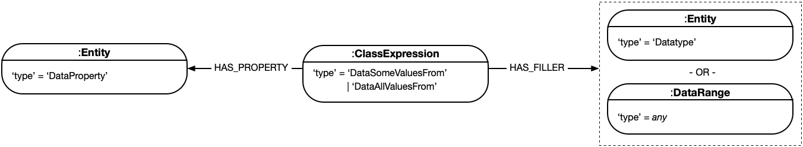


#### 2.4.2 Literal Value Restriction

A has-value class expression `DataHasValue( DP lt )` consists of a data property `DP` and a literal `lt`, and it contains all those individuals that are connected by `DP` to `lt`.

<u>OWL 2 Notation</u>:

​	**DataHasValue** := 'DataHasValue' '(' **DataProperty** **Literal** ')'

<u>LPG Diagram</u>:

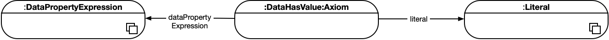


### 2.5 Data Property Cardinality Restrictions

A *minimum cardinality* expression `DataMinCardinality( n DP DR )` consists of a nonnegative integer `n`, a data property `DP`, and a unary data range `DR`, and it contains all those individuals that are connected by `DP` to at least `n` different literals in `DR`.

A *maximum cardinality* expression `DataMaxCardinality( n DP DR )` consists of a nonnegative integer `n`, a data property `DP`, and a unary data range `DR`, and it contains all those individuals that are connected by `DP` to at most `n` different literals in `DR`.

An *exact cardinality* expression `DataExactCardinality( n DP DR )` consists of a nonnegative integer `n`, a data property `DP`, and a unary data range `DR`, and it contains all those individuals that are connected by `DP` to exactly `n` different literals in `DR`.

In all cases, if `DR` is not present, it is taken to be *rdfs:Literal*.

<u>OWL 2 Notation</u>:

​	**DataMinCardinality** := 'DataMinCardinality' '(' **nonNegativeInteger** **DataProperty** [ **DataRange** ] ')'

​	**DataMaxCardinality** := 'DataMaxCardinality' '(' **nonNegativeInteger** **DataProperty** [ **DataRange** ] ')'

​	**DataExactCardinality** := 'DataExactCardinality' '(' **nonNegativeInteger** **DataProperty** [ **DataRange** ] ')'

<u>LPG Diagram</u>:


## 3 Data Ranges

### 3.1 Intersection and Union of Data Ranges

An *intersection* data range `DataIntersectionOf( DR1 ... DRn )` contains all tuples of literals that are contained in each data range `DRi` for 1 ≤ i ≤ n. All data ranges `DRi` *must* be of the same arity, and the resulting data range is of that arity as well.

A *union* data range `DataUnionOf( DR1 ... DRn )` contains all tuples of literals that are contained in the at least one data range `DRi` for 1 ≤ i ≤ n. All data ranges `DRi` *must* be of the same arity, and the resulting data range is of that arity as well.

<u>OWL 2 Notation</u>:

  **DataIntersectionOf** := 'DataIntersectionOf' '(' **DataRange** **DataRange** { **DataRange** } ')'

  **DataUnionOf** := 'DataUnionOf' '(' **DataRange** **DataRange** { **DataRange** } ')'

<u>LPG Diagram</u>:

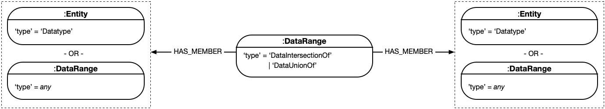


### 3.2 Complement of Data Ranges

A complement data range `DataComplementOf( DR )` contains all tuples of literals that are not contained in the data range `DR`. The resulting data range has the arity equal to the arity of `DR`.

<u>OWL 2 Notation</u>:

  **DataComplementOf** := 'DataComplementOf' '(' **DataRange** ')'

<u>LPG Diagram</u>:


### 3.3 Enumeration of Literals

An enumeration of literals `DataOneOf( lt1 ... ltn )` contains exactly the explicitly specified literals `lti` with 1 ≤ i ≤ n. The resulting data range has arity one.

<u>OWL 2 Notation</u>:

  **DataOneOf** := 'DataOneOf' '(' **Literal** { **Literal** } ')'

<u>LPG Diagram</u>:


### 3.4 Datatype Restrictions

A datatype restriction `DatatypeRestriction( DT F1 lt1 ... Fn ltn )` consists of a unary datatype `DT` and `n` pairs `( Fi , lti )`. The resulting data range is unary and is obtained by restricting the value space of `DT` according to the semantics of all `( Fi , vi )` (multiple pairs are interpreted conjunctively), where `vi` are the data values of the literals `lti`.

In an OWL 2 DL ontology, each pair `( Fi , vi )` *must* be contained in the facet space of `DT` (see [Datatype Maps](https://www.w3.org/TR/owl2-syntax/#Datatype_Maps) from the OWL 2 specification document).

<u>OWL 2 Notation</u>:

  **DatatypeRestriction** := 'DatatypeRestriction' '(' **Datatype** **constrainingFacet** **restrictionValue** { **constrainingFacet** **restrictionValue** } ')'

  **constrainingFacet** := **IRI**

  **restrictionValue** := **Literal**

<u>LPG Diagram</u>:


## 4 Axioms

### 4.1 Class Expression Axioms

#### 4.1.1 Subclass

A subclass axiom `SubClassOf( CE1 CE2 )` states that the class expression `CE1` is a subclass of the class expression `CE2`. Roughly speaking, this states that `CE1` is more specific than `CE2`.

<u>OWL 2 Notation</u>:

​	**SubClassOf** := 'SubClassOf' '(' { **Annotation** } **subClassExpression** **superClassExpression** ')'

​	**subClassExpression** := **ClassExpression**

​	**superClassExpression** := **ClassExpression**

<u>LPG Diagram</u>:


#### 4.1.2 Equivalent Classes

An equivalent classes axiom `EquivalentClasses( CE1 ... CEn )` states that all of the class expressions `CEi`, 1 ≤ i ≤ n, are semantically equivalent to each other. This axiom allows one to use each `CEi` as a synonym for each `CEj` — that is, in any expression in the ontology containing such an axiom, `CEi` can be replaced with `CEj` without affecting the meaning of the ontology.

<u>OWL 2 Notation</u>:

​	**EquivalentClasses** := 'EquivalentClasses' '(' { **Annotation** } **ClassExpression** **ClassExpression** { **ClassExpression** } ')'

<u>LPG Diagram</u>:


#### 4.1.3 Disjoint Classes

A disjoint classes axiom `DisjointClasses( CE1 ... CEn )` states that all of the class expressions `CEi`, 1 ≤ i ≤ n, are pairwise disjoint; that is, no individual can be at the same time an instance of both `CEi` and `CEj` for i ≠ j. 

<u>OWL 2 Notation</u>:

​	**DisjointClasses** := 'DisjointClasses' '(' { **Annotation** } **ClassExpression** **ClassExpression** { **ClassExpression** } ')'

<u>LPG Diagram</u>:


### 4.2 Object Property Axioms

#### 4.2.1 Object Subproperties

An object subproperty axiom `SubObjectPropertyOf( OPE1 OPE2 )`. This axiom states that the object property expression `OPE1` is a subproperty of the object property expression `OPE2` — that is, if an individual `x` is connected by `OPE1` to an individual `y`, then`x` is also connected by `OPE2` to `y`.

<u>OWL 2 Notation</u>:

​	**SubObjectPropertyOf** := 'SubObjectPropertyOf' '(' { **Annotation** } **subObjectPropertyExpression** **superObjectPropertyExpression** ')'

​	**subObjectPropertyExpression** := **ObjectPropertyExpression**

​	**superObjectPropertyExpression** := **ObjectPropertyExpression**

<u>LPG Diagram</u>:


#### 4.2.2 Equivalent Object Properties

An equivalent object properties axiom `EquivalentObjectProperties( OPE1 ... OPEn )` states that all of the object property expressions `OPEi`, 1 ≤ i ≤ n, are semantically equivalent to each other. This axiom allows one to use each `OPEi` as a synonym for each `OPEj` — that is, in any expression in the ontology containing such an axiom, `OPEi` can be replaced with `OPEj` without affecting the meaning of the ontology.

<u>OWL 2 Notation</u>:

​	**EquivalentObjectProperties** := 'EquivalentObjectProperties' '(' { **Annotation** } **ObjectPropertyExpression** **ObjectPropertyExpression** { **ObjectPropertyExpression** } ')'

<u>LPG Diagram</u>:


#### 4.2.3 Disjoint Object Properties

A disjoint object properties axiom `DisjointObjectProperties( OPE1 ... OPEn )` states that all of the object property expressions `OPEi`, 1 ≤ i ≤ n, are pairwise disjoint; that is, no individual `x` can be connected to an individual `y` by both `OPEi` and `OPEj` for i ≠ j.

<u>OWL 2 Notation</u>:

​	**DisjointObjectProperties** := 'DisjointObjectProperties' '(' { **Annotation** } **ObjectPropertyExpression** **ObjectPropertyExpression** { **ObjectPropertyExpression** } ')'

<u>LPG Diagram</u>:


#### 4.2.4 Inverse Object Properties

An inverse object properties axiom `InverseObjectProperties( OPE1 OPE2 )` states that the object property expression `OPE1` is an inverse of the object property expression `OPE2`. Thus, if an individual `x` is connected by `OPE1` to an individual `y`, then `y` is also connected by `OPE2` to `x`, and vice versa.

<u>OWL 2 Notation</u>:

​	**InverseObjectProperties** := 'InverseObjectProperties' '(' { **Annotation** } **ObjectPropertyExpression** **ObjectPropertyExpression** ')'

<u>LPG Diagram</u>:


#### 4.2.5 Object Property Domain and Range

An object property *domain* axiom `ObjectPropertyDomain( OPE CE )` states that the domain of the object property expression `OPE` is the class expression `CE` — that is, if an individual `x` is connected by `OPE` with some other individual, then `x` is an instance of `CE`.

An object property *range* axiom `ObjectPropertyRange( OPE CE )` states that the range of the object property expression `OPE` is the class expression `CE` — that is, if some individual is connected by `OPE` with an individual `x`, then `x` is an instance of `CE`. 

<u>OWL 2 Notation</u>:

​	**ObjectPropertyDomain** := 'ObjectPropertyDomain' '(' { **Annotation** } **ObjectPropertyExpression** **ClassExpression** ')'

​	**ObjectPropertyRange** := 'ObjectPropertyRange' '(' { **Annotation** } **ObjectPropertyExpression** **ClassExpression** ')'

<u>LPG Diagram</u>:

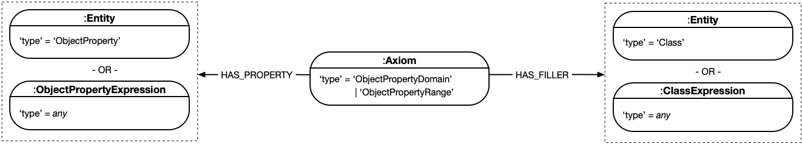


#### 4.2.6 Object Property Characteristics

An object property *functionality* axiom `FunctionalObjectProperty( OPE )` states that the object property expression `OPE` is functional — that is, for each individual `x`, there can be at most one distinct individual `y` such that `x` is connected by `OPE` to `y`.

An object property *inverse functionality* axiom `InverseFunctionalObjectProperty( OPE )` states that the object property expression `OPE` is inverse-functional — that is, for each individual `x`, there can be at most one individual `y` such that `y` is connected by `OPE` with `x`.

An object property *reflexivity* axiom `ReflexiveObjectProperty( OPE )` states that the object property expression `OPE` is reflexive — that is, each individual is connected by `OPE` to itself.

An object property *irreflexivity* axiom `IrreflexiveObjectProperty( OPE )` states that the object property expression `OPE` is irreflexive — that is, no individual is connected by `OPE` to itself.

An object property *symmetry* axiom `SymmetricObjectProperty( OPE )` states that the object property expression `OPE` is symmetric — that is, if an individual `x` is connected by `OPE` to an individual `y`, then `y` is also connected by `OPE` to `x`.

An object property *asymmetry* axiom `AsymmetricObjectProperty( OPE )` states that the object property expression `OPE` is asymmetric — that is, if an individual `x` is connected by `OPE` to an individual `y`, then `y` cannot be connected by `OPE` to `x`.

An object property *transitivity* axiom `TransitiveObjectProperty( OPE )` states that the object property expression `OPE` is transitive — that is, if an individual `x` is connected by `OPE` to an individual `y` that is connected by `OPE` to an individual `z`, then `x` is also connected by `OPE` to `z`.

<u>OWL 2 Notation</u>:

​	**FunctionalObjectProperty** := 'FunctionalObjectProperty' '(' { **Annotation** } **ObjectPropertyExpression** ')'

​	**InverseFunctionalObjectProperty** := 'InverseFunctionalObjectProperty' '(' { **Annotation** } **ObjectPropertyExpression** ')'

​	**ReflexiveObjectProperty** := 'ReflexiveObjectProperty' '(' { **Annotation** } **ObjectPropertyExpression** ')'	

​	**IrreflexiveObjectProperty** := 'IrreflexiveObjectProperty' '(' { **Annotation** } **ObjectPropertyExpression** ')'

​	**SymmetricObjectProperty** := 'SymmetricObjectProperty' '(' { **Annotation** } **ObjectPropertyExpression** ')'

​	**AsymmetricObjectProperty** := 'AsymmetricObjectProperty' '(' { **Annotation** } **ObjectPropertyExpression** ')'

​	**TransitiveObjectProperty** := 'TransitiveObjectProperty' '(' { **Annotation** } **ObjectPropertyExpression** ')'

<u>LPG Diagram</u>:


### 4.3 Data Property Axioms

#### 4.3.1 Data Subproperties

A data subproperty axiom `SubDataPropertyOf( DP1 DP2 )` states that the data property `DP1` is a subproperty of the data property `DP2` — that is, if an individual `x` is connected by `DP1` to a literal `y`, then `x` is connected by `DP2` to `y` as well.

<u>OWL 2 Notation</u>:

​	**SubDataPropertyOf** := 'SubDataPropertyOf' '(' { **Annotation** } **subDataProperty** **superDataProperty** ')'

​	**subDataProperty** := **DataProperty**

​	**superDataProperty** := **DataProperty**

<u>LPG Diagram</u>:


#### 4.3.2 Equivalent Data Properties

An equivalent data properties axiom `EquivalentDataProperties( DP1 ... DPn )` states that all the data property `DPi`, 1 ≤ i ≤ n, are semantically equivalent to each other. This axiom allows one to use each `DPi` as a synonym for each `DPj` — that is, in any expression in the ontology containing such an axiom, `DPi` can be replaced with `DPj` without affecting the meaning of the ontology. 

<u>OWL 2 Notation</u>:

​	**EquivalentDataProperties** := 'EquivalentDataProperties' '(' { **Annotation** } **DataProperty** **DataProperty** { **DataProperty** } ')'

<u>LPG Diagram</u>:


#### 4.3.3 Disjoint Data Properties

A disjoint data properties axiom `DisjointDataProperties( DP1 ... DPn )` states that all of the data property `DPi`, 1 ≤ i ≤ n, are pairwise disjoint; that is, no individual `x` can be connected to a literal `y` by both `DPi` and `DPj` for i ≠ j.

<u>OWL 2 Notation</u>:

​	**DisjointDataProperties** := 'DisjointDataProperties' '(' { **Annotation** } **DataProperty** **DataProperty** { **DataProperty** } ')'

<u>LPG Diagram</u>:


#### 4.3.4 Data Property Domain

A data property domain axiom `DataPropertyDomain( DP CE )` states that the domain of the data property  `DP` is the class expression `CE` — that is, if an individual `x` is connected by `DP` with some literal, then `x` is an instance of `CE`.

<u>OWL 2 Notation</u>:

​	**DataPropertyDomain** := 'DataPropertyDomain' '(' { **Annotation** } **DataProperty** **ClassExpression** ')'

<u>LPG Diagram</u>:


#### 4.3.5 Data Property Range

A data property range axiom `DataPropertyRange( DP DR )` states that the range of the data property `DP` is the data range `DR` — that is, if some individual is connected by `DP` with a literal `x`, then `x` is in `DR`. The arity of `DR` *must* be one. 

<u>OWL 2 Notation</u>:

​	**DataPropertyRange** := 'DataPropertyRange' '(' { **Annotation** } **DataProperty** **DataRange** ')'

<u>LPG Diagram</u>:


#### 4.3.6 Functional Data Properties

A data property functionality axiom `FunctionalDataProperty( DP )` states that the data property `DP` is functional — that is, for each individual `x`, there can be at most one distinct literal `y` such that `x` is connected by `DP` with `y`.

<u>OWL 2 Notation</u>:

​	**FunctionalDataProperty** := 'FunctionalDataProperty' '(' { **Annotation** } **DataProperty** ')'

<u>LPG Diagram</u>:

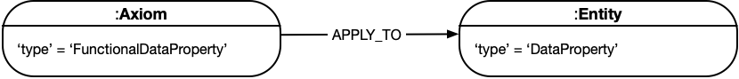


### 4.4 Assertions

#### 4.4.1 Class Assertions

A class assertion `ClassAssertion( CE a )` states that the individual `a` is an instance of the class expression `CE`.

<u>OWL 2 Notation</u>:

​	**ClassAssertion** := 'ClassAssertion' '(' { **Annotation** } **ClassExpression** **Individual** ')'

<u>LPG Diagram</u>:


#### 4.4.2 Object Property Assertions

A positive object property assertion `ObjectPropertyAssertion( OPE a1 a2 )` states that the individual `a1` is connected by the object property expression `OPE` to the individual `a2`.

A negative object property assertion `NegativeObjectPropertyAssertion( OPE a1 a2 )` states that the individual `a1` is not connected by the object property expression `OPE` to the individual `a2`.

<u>OWL 2 Notation</u>:

​	**ObjectPropertyAssertion** := 'ObjectPropertyAssertion' '(' { **Annotation** } **ObjectPropertyExpression** **sourceIndividual** **targetIndividual** ')'

​	**NegativeObjectPropertyAssertion** := 'NegativeObjectPropertyAssertion' '(' { **Annotation** } **ObjectPropertyExpression** **sourceIndividual** **targetIndividual** ')'

<u>LPG Diagram</u>:


#### 4.4.3 Data Property Assertions

A positive data property assertion `DataPropertyAssertion( DP a lt )` states that the individual a is connected by the data property `DP` to the literal `lt`.

A negative data property assertion `NegativeDataPropertyAssertion( DP a lt )` states that the individual a is not connected by the data property `DP` to the literal `lt`.

<u>OWL 2 Notation</u>:

​	**DataPropertyAssertion** := 'DataPropertyAssertion' '(' { **Annotation** } **DataPropertyExpression** **sourceIndividual** **targetValue** ')'

​	**NegativeDataPropertyAssertion** := 'NegativeDataPropertyAssertion' '(' { **Annotation** } **DataPropertyExpression** **sourceIndividual** **targetValue** ')'	

<u>LPG Diagram</u>:


#### 4.4.4 Individual Equality

An individual equality axiom `SameIndividual( a1 ... an )` states that all of the individuals `ai`, 1 ≤ i ≤ n, are equal to each other. This axiom allows one to use each `ai` as a synonym for each `aj` — that is, in any expression in the ontology containing such an axiom, `ai` can be replaced with `aj` without affecting the meaning of the ontology.

<u>OWL 2 Notation</u>:

​	**SameIndividual** := 'SameIndividual' '(' { **Annotation** } **Individual** **Individual** { **Individual** } ')'

<u>LPG Diagram</u>:


#### 4.4.5 Individual Inequality

An individual inequality axiom `DifferentIndividuals( a1 ... an )` states that all of the individuals `ai`, 1 ≤ i ≤ n, are different from each other; that is, no individuals `ai` and `aj` with i ≠ j can be derived to be equal. This axiom can be used to axiomatize the *unique name assumption* — the assumption that all different individual names denote different individuals.

<u>OWL 2 Notation</u>:

​	**DifferentIndividuals** := 'DifferentIndividuals' '(' { **Annotation** } **Individual** **Individual** { **Individual** } ')'

<u>LPG Diagram</u>:


## 5 Annotations

### 5.1 Annotation of Ontologies, Axioms, and other Annotations

Ontologies, axioms, and annotations themselves can be annotated using annotations. Such annotations consist of an annotation property and an annotation value, where the latter can be IRIs or literals.

<u>OWL 2 Notation</u>:

​	**Annotation** := 'Annotation' '(' { **Annotation** } **AnnotationProperty** **AnnotationValue** ')'

​	**AnnotationValue** :=  **Literal** | **IRI**

<u>LPG Diagram</u>:


### 5.2 Annotation Axioms

#### 5.2.1 Annotation Assertions

An annotation assertion `AnnotationAssertion( AP as av )` states that the annotation subject as — an IRI  — is annotated with the annotation property `AP` and the annotation value `av`.

<u>OWL 2 Notation</u>:

​	**AnnotationAssertion** := 'AnnotationAssertion' '(' { **Annotation** } **AnnotationProperty** **AnnotationSubject** **AnnotationValue** ')'

​	**AnnotationValue** :=  **Literal** | **IRI**

<u>LPG Diagram</u>:


#### 5.2.2 Annotation Subproperties

An annotation subproperty axiom `SubAnnotationPropertyOf( AP1 AP2 )` states that the annotation property `AP1` is a subproperty of the annotation property `AP2`.

<u>OWL 2 Notation</u>:

​	**SubAnnotationPropertyOf** := 'SubAnnotationPropertyOf' '(' { **Annotation** } **subAnnotationProperty** **superAnnotationProperty** ')'

​	**subAnnotationProperty** := **AnnotationProperty**

​	**superAnnotationProperty** := **AnnotationProperty**

<u>LPG Diagram</u>:


## 6 Change History

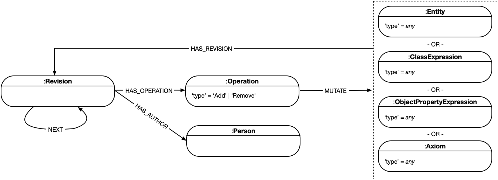


